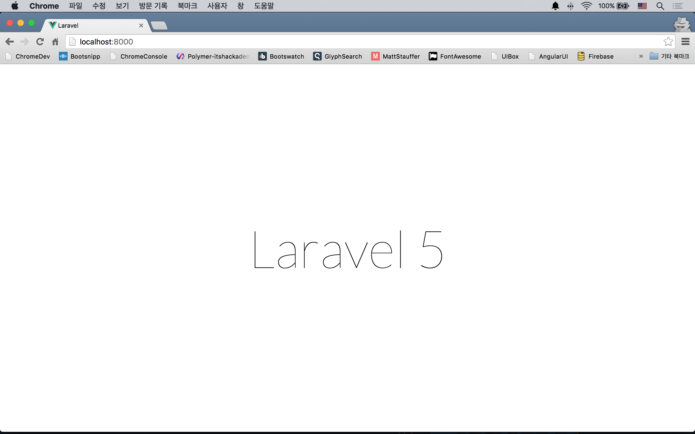

# 2강 - 라라벨 5 설치하기 (on Windows)


## 개발 환경 셋업

### [이 코스에서 사용] 로컬 개발 환경

Windows 사용자에게도 2가지 옵션이 있다. 로컬 PC를 개발 머신으로 쓰거나, 다음 절에 설명하는 "Homestead"를 쓰는 방법이다. 이 코스에서는 **로컬 PC를 개발환경으로 쓰는 것을 가정하고 설명**한다. [로컬 PC에 php, mySql 이 설치되어 있지 않다면 조연웅님의 AutoSet 을 설치하자](http://sourceforge.net/projects/project-autoset/).

그리고, 코맨드 프롬프트 대체 프로그램인 [Git Bash](https://git-for-windows.github.io/) 설치를 권장한다.

## **[OPTIONAL]** 공짜로 쓰는 개발 서버 "Homestead"

Virtualbox[https://www.virtualbox.org/]와 Vargrant[https://www.vagrantup.com/]가 필요하다. 개발팀 간에 동일한 개발 환경을 가지기 위해서, 또는 Production과 유사한 환경에서 개발하기 위해서 Homestead 사용을 권장한다. Homestead는 위에서 언급한 필요 확장 모듈이 기본 설치되어 있다.

설정법은 꽤나 까다로우니 [공식 문서](http://laravel.com/docs/homestead)를 참고하자.

## 라라벨이 동작하기 위한 php 버전 및 필요 모듈 조건 확인

라라벨을 설치하려는 개발환경 또는 서버가 아래 필요사항을 충족하는 지 확인한다.
- php 5.5.9 이상
- php Extensions
    - OpenSSL
    - PDO
    - Mbstring
    - Tokenizer
    
```bash
\> php --version # PHP 5.6.xx
\> php -m | findstr openssl
\> php -m | findstr pdo
\> php -m | findstr mbstring
\> php -m | findstr tokenizer
```

하나라도 빠진게 있다면 구글링해서 설치하자~

## 이제 라라벨을 설치해 보자.

라라벨 인스톨러를 사용할 것을 권장한다. 왜냐하면 Composer를 이용해 설치하는 것 보다 훨~씬 빠르니까...

먼저, Composer 가 필요하다. 왜냐하면, 라라벨 인스톨러가 Composer를 통해 배포되기 때문이다. [윈도우즈용 Composer 인스톨러](https://getcomposer.org/Composer-Setup.exe)를 다운로드 받아 설치하자.

```bash
\> composer --version # Composer version 1.xx
```

이제 Composer를 이용해서 라라벨 인스톨러를 설치한다.

```bash
\> composer global require "laravel/installer=~1.1"
```

끝이 아니다. `laravel`과 `homestead` 코맨드를 어디서든 접근할 수 있게 경로 설정하자. 제어판 -> 시스템 -> 고급 -> 시스템 변수에서 Path 부분을 찾은 다음, C:\path-to-user\Application Data\Composer\vendor\bin 을 추가하자. 열려 있던 코맨드 프롬프트를 닫고, 새로운 코맨드 프롬프트를 열고 경로 설정이 잘 먹었는 지 확인해 보자.

```bash
\> laravel --version # Laravel Installer version 1.2.1
```

**`참고`** 간혹, `Hong Gildong`과 같이 사용자 이름에 공백을 넣어 계정을 생성하는 경우가 있는데, 이 경우에는 개발을 위해 공백이 없는 사용자 계정을 하나 따로 만들고 로그온해서 사용할 것을 권장한다.

휴~, 이제 설치를 위한 준비가 완료되었다. 라라벨 인스톨러로 라라벨 5를 설치하자.

```bash
\> laravel new myProject
\> cd myProject
\> php artisan --version # Laravel Framework version 5.1.22 (LTS)
```

서버를 부트업하고, 라라벨을 시작해 보자!

```bash
# 로컬 서버를 부트한다.
\> php artisan serve //종료하기 ctrl+c
\> open http://localhost:8000

# Homestead를 설치/셋팅한 분이 있다면, 로컬 서버 부트 대신 homestead VM를 부트한다.
\> homestead up //종료하기 homestead suspend
\> open http://localhost:8000
```

Laravel 5 란 글씨가 써진 화면이 보인다면, 성공적으로 설치한 것이다.



**`참고`** `artisan`은 라라벨의 코맨드 라인 툴이다. `\> php artisan`을 실행한 후, 설명을 쭈욱~ 한번 살펴보자. 개발 중에 코드에디터와 콘솔을 오가면서, `artisan` 코맨드를 많이 사용하게 될 것이다.

프로젝트의 디렉토리 구조와 라라벨의 동작 시퀀스 다이어그램은 Mac용 설치 문서 "[2강 - 라라벨 5 설치하기](02-hello-laravel.md)"를 참조하자.

---

- [목록으로 돌아가기](../readme.md)
- [1강 - 처음 만나는 라라벨](01-welcome.md)
- [3강 - 글로벌 설정 살펴보기](03-configuration.md)