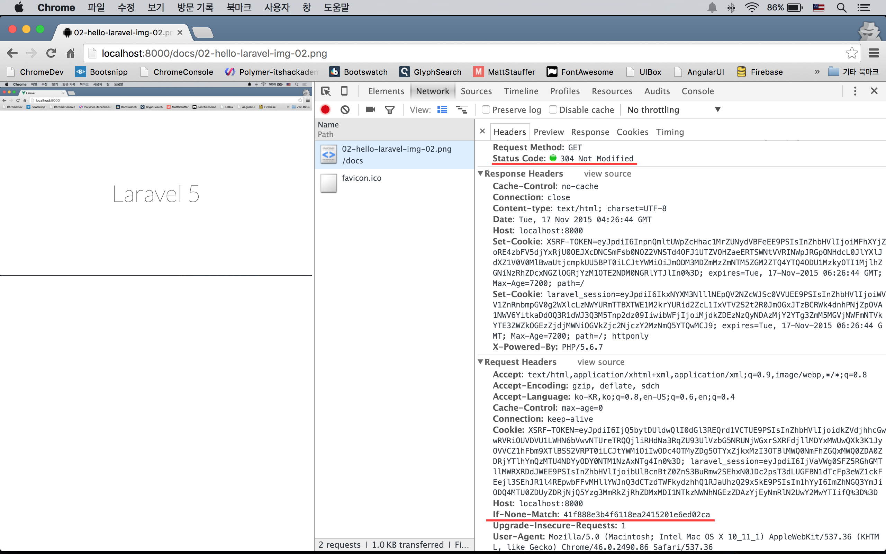

# 실전 프로젝트 1 - Markdown Viewer 

## 30강 - Debug & Final Touch

**`필독`** 프론트엔드에 관심이 없더라도, 1번과 2번은 백엔드 내용이므로 보도록 하자.

29강까지 작성한 우리 프로젝트에는 3가지 문제가 있다.

1.  이미지가 정상적으로 표시되지 않는다.
2.  브라우저의 이미지 캐시가 동작하지 않는다.  
3.  코드 블럭에 Syntax Highlight가 없다.

### 이미지 표시하기

우리 이미지는 public 디렉토리 밖에, 그러니까 public 과 같은 레벨인 docs 디렉토리에 위치하고 있다. 즉 웹 서버가 접근할 수 없는 위치에 있다는 것이다. 이럴 경우에는 Route 에서 이미지 파일에 대한 요청을 받아서, 컨트롤러에서 DocumentRoot(==public) 바깥 쪽에 위치한 이미지를 찾아 정확한 Content-Type 으로 응답해 주어야 한다.

app/Http/routes.php 에 이미지 요청을 컨트롤러와 연결시키는 Route를 작성하자. 기존 문서 요청과 Route가 거의 동일하여, 이를 분리시키기 위하여 라라벨 Route의 글로벌 패턴이란 기능을 사용하였다. `Route::pattern()`의 첫번째 인자는 Route Parameter 이름, 두번째 인자는 정규표현식이다. 이 예제의 정규표현식은 01-welcome-image-01.png 에서는 매칭이 발생하고, 01-welcome.md 에서는 매칭이 발생하기 않는다. 해서, `Route::get('docs/{image}')`에서는 이미지 파일만 응답하고, `Route::get('docs/{file?}')` 에서는 나머지 docs로 시작하는 모든 경우에 대해 응답하게 된다.

```php
Route::pattern('image', '(?P<parent>[0-9]{2}-[\pL-\pN\._-]+)-(?P<suffix>img-[0-9]{2}.png)');

Route::get('docs/{image}', [
    'as'   => 'documents.image',
    'uses' => 'DocumentsController@image'
]);

Route::get('docs/{file?}', [
    'as'   => 'documents.show',
    'uses' => 'DocumentsController@show'
]);
```

**`참고`** Route Parameter에 대한 패턴이, 가령 `{image}`에 대한 패턴이 여러군데 쓰이면 `Route::pattern()`과 같이 글로벌 패턴을 사용한다. 여러 곳에 쓰지 않고 특정 Route 에서만 사용된다면, `Route::get('docs/{image}', '...')->where('image', 'pattern')` 처럼 사용할 수도 있다. 

**`참고`** 정규표현식의 작성 및 테스트를 위해서는 [Regex101](https://regex101.com/) 사이트를 이용할 것을 추천한다. 필자가 본 정규표현식 툴 중 최고이다.

이미지 응답을 만들기 위해서 intervention/image 패키지를 이용할 것이다. composer 로 설치하고, [매뉴얼](http://image.intervention.io/getting_started/installation#laravel)에 따라 config/app.php 파일에 서비스프로바이더, Facade도 추가하자.

```bash
$ composer require "intervention/image:2.3.*"
```

```php
//config/app.php
return [
    ...,
    'providers' => [
        ...,
        Intervention\Image\ImageServiceProvider::class,
    ],
    
    'aliases' => [
        ...,
        'Image' => Intervention\Image\Facades\Image::class,
    ]
];
```

이제 Image Facade를 이용할 수 있으니, Document 모델과 DocumentsController 를 수정하자. Document 모델에서 중복 제거를 위해 여러군데 refactoring 된 것을 확인할 수 있다.

```php
// app/Document.php
<?php

namespace App;

use File;
use Image;

class Document
{
    private $directory;

    public function __construct($directory = 'docs')
    {
        $this->directory = $directory;
    }

    public function get($file = 'index.md')
    {
        return File::get($this->getPath($file));
    }

    public function image($file)
    {
        return Image::make($this->getPath($file));
    }

    private function getPath($file)
    {
        $path = base_path($this->directory . DIRECTORY_SEPARATOR . $file);

        if (! File::exists($path)) {
            abort(404, 'File not exist');
        }

        return $path;
    }
}
```

`image()` 메소드에서 인자로 넘겨 받은 파일을 찾아 `\Intervention\Image\Image` 인스턴스를 리턴한다. 

```php
// app/Http/Controllers/DocumentsController.php
<?php

namespace App\Http\Controllers;

use App\Document;
use Cache;
use Image;
use Request;

class DocumentsController extends Controller
{
    protected $document;

    public function __construct(Document $document)
    {
        $this->document = $document;
    }

    public function show($file = '01-welcome.md')
    {
        ...
    }

    public function image($file)
    {
        $image = $this->document->image($file);

        return response($image->encode('png'), 200, [
            'Content-Type'  => 'image/png'
        ]);
    }
}
```

`image()` 메소드에서 `Content-Type`을 png 타입으로 지정하고, 모델로 부터 넘겨 받은 이미지 인스턴스를 컨텐츠로 해서 HTTP 응답을 하고 있다.


### 브라우저 캐시 살리기

intervention/image 를 이용해서 만든 이미지 응답은 웹 서버가 접근할 수 있는 DocumentRoot(== public)에 있는 리소스로 만들어진 것이 아니다. 정해진 Route 규칙에 따라 요청하면 서버에서 이미지를 DocumentRoot 밖에서 찾아 반응하는 이미지 응답이기 때문에, 웹 서버가 브라우저 캐싱에 관여할 수 없다. 해서 수동으로 브라우저 캐싱 기능을 살려 주어야 한다.
 
구현을 위해 웹서버와 브라우저간의 캐싱 메카니즘을 이해해야 한다. 브라우저가 리소스(이 예제에서는 이미지) 요청을 할 때, 캐시에 요청할 URL 과 연결된 캐시가 있는 지 확인하고, 키 값을 얻어온다. 이 키 값은 이전 동일 URL 요청에서 서버가 Etag 헤더 값으로 응답한 것이다. 얻어온 키 값은 If-Non-Match 헤더의 값으로 지정하고 서버에 리소스를 요청한다. 요청을 받은 서버는 If-Non-Match 헤더의 값과 URL 에 해당하는 서버의 Etag 로직에 의해 생성된 값을 비교하여, 같으면 304 Not Modified를, 다르면 200 OK와 함께 요청한 리소스를 HTTP 바디로 해서 응답한다. 아래 그림을 보자.


*`Image Source` ["Etags and browser cache, June 26 2015"](http://thespringthing.blogspot.kr/2015/06/etags-and-browser-cache.html)*

먼저 Etag를 만드는 로직을 Document 모델에 구현하자. `md5()` php 내장 해시 함수를 사용하였다. Etag 값은 고유하기만 하면 어떤 문자열을 사용해도 상관없다.

```php
class Document
{
    ...
    public function etag($file)
    {
        return md5($file . '/' . File::lastModified($this->getPath($file)));
    }
    ...
}
```

DocumentsController 에서 요청으로 받은 Etag값과 Document 모델에서 생성한 Etag 값과 비교하여 같으면 304, 같지 않으면 200을 응답하는 로직을 만들어보자.
 
```php
class DocumentsController extends Controller
{
    ...
    public function image($file)
    {
        $image = $this->document->image($file);
        $reqEtag = Request::getEtags();
        $genEtag = $this->document->etag($file);

        if (isset($reqEtag[0])) {
            if ($reqEtag[0] === $genEtag) {
                return response('', 304);
            }
        }

        return response($image->encode('png'), 200, [
            'Content-Type'  => 'image/png',
            'Cache-Control' => 'public, max-age=0',
            'Etag'          => $genEtag,
        ]);
    }
}
```



### Syntax Highlight 적용하기

Syntax Highlight를 위한 Bower 콤포넌트를 설치하자!

```bash
$ bower install google-code-prettify --save-dev
```

gulpfile.js에 방금 다운로드 받은 패키지를 추가하자.

```javascript
elixir(function (mix) {
  mix
    .sass('...')
    .scripts([
      '...',
      '../vendor/google-code-prettify/src/run_prettify.js',
      'app.js'
    ], 'public/js/app.js')
    ....
  });
}
```

해당 패키지에 대한 [사용법은 여기](https://code.google.com/p/google-code-prettify/wiki/GettingStarted)서 익혔다. 마크다운 컴파일러는 코드블럭을 `<pre>` 태그로 컴파일 한다. 따라서, `<pre>` 태그에 방금 설치한 google-code-prettify의 스타일시트가 반응하도록 클래스를 추가해 줄 것이다. 마크다운 문서에 직접 추가할 수 없으니, resources/assets/js/app.js에 jQuery를 이용해 동적으로 추가해 보자.

```javascript
$("pre").addClass("prettyprint");
```

gulp 커맨드로 다시 빌드하고, 캐시도 지운 후 Syntax Highlight가 작 적용되었는지 확인해 보자.

```bash
$ gulp --production
$ php artisan cache:clear
```


---

- [목록으로 돌아가기](../readme.md)
- [29강 - Elixir](29-elixir.md)
