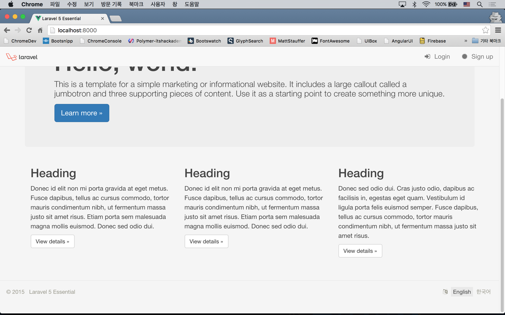
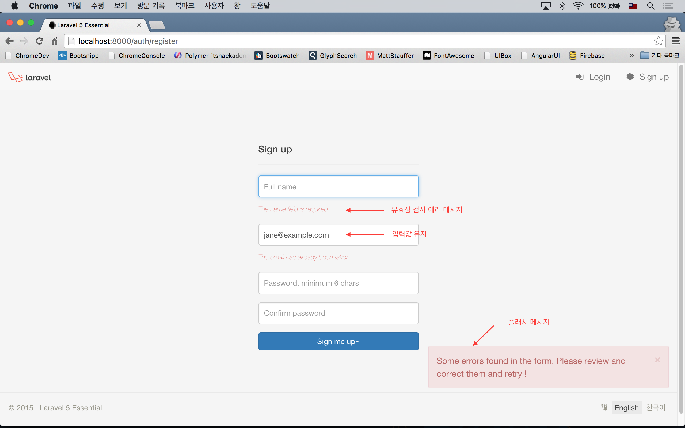
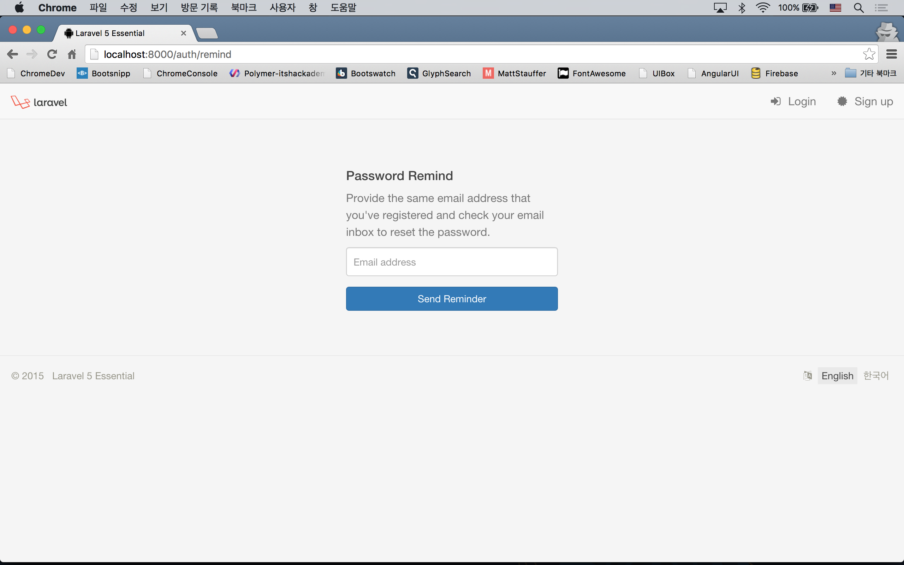
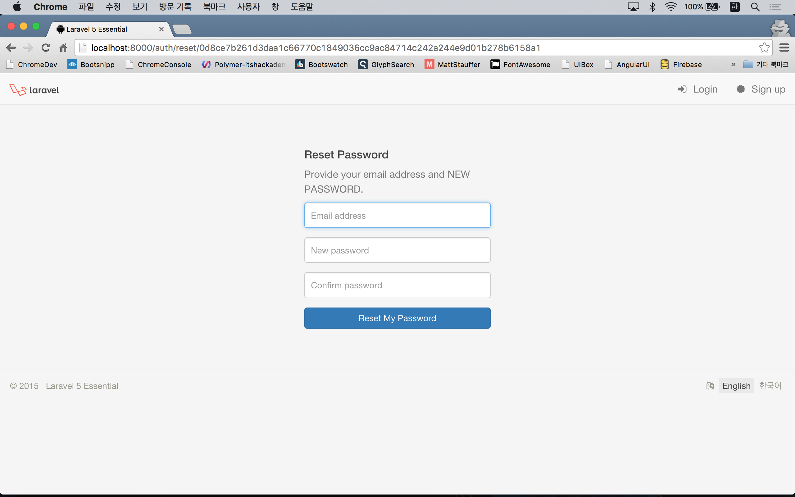

# 실전 프로젝트 2 - Forum

실습을 진행하기 전에 기존에 만들었던 파일 중, 쓰지 않을 파일이나, 쓰지 않을 코드 블럭들을 삭제할 것을 권장한다. 정리하지 않아도 무방하긴 하지만...

## 32강 - 사용자 로그인

기본기 16강, 17강에서 배운 내용을 기반으로 사용자 로그인 기능을 만들어 보자. 여러개로 쪼개기도 뭣 하고... 그리고, 진도를 좀 많이 빼기 위해, 이번 강좌에서 욕심을 좀 냈으니 지치지 말고 따라해 주기 바란다.

### Route 정의

app/Http/routes.php에 사용자 등록, 로그인/아웃, 비밀번호 초기화, 홈페이지, 로그인 후 이동할 페이지 등에 사용할 엔드포인트를 먼저 만들자. 서비스에 사용할 수 있을 만큼의 퀄리티를 내기 위해 이번 강좌부터는 코드량이 좀 많다.

```php
Route::get('/', [
    'as' => 'root',
    'uses' => 'WelcomeController@index'
]);

Route::get('home', [
    'as' => 'home',
    'uses' => 'WelcomeController@index'
]);

/* User Registration */
Route::group(['prefix' => 'auth', 'as' => 'user.'], function () {
    Route::get('register', [
        'as'   => 'create',
        'uses' => 'Auth\AuthController@getRegister'
    ]);
    Route::post('register', [
        'as'   => 'store',
        'uses' => 'Auth\AuthController@postRegister'
    ]);
});

/* Session */
Route::group(['prefix' => 'auth', 'as' => 'session.'], function () {
    Route::get('login', [
        'as'   => 'create',
        'uses' => 'Auth\AuthController@getLogin'
    ]);
    Route::post('login', [
        'as'   => 'store',
        'uses' => 'Auth\AuthController@postLogin'
    ]);
    Route::get('logout', [
        'as'   => 'destroy',
        'uses' => 'Auth\AuthController@getLogout'
    ]);
});

/* Password Reminder */
Route::group(['prefix' => 'password'], function () {
    Route::get('remind', [
        'as'   => 'reminder.create',
        'uses' => 'Auth\PasswordController@getEmail'
    ]);
    Route::post('remind', [
        'as'   => 'reminder.store',
        'uses' => 'Auth\PasswordController@postEmail'
    ]);
    Route::get('reset/{token}', [
        'as'   => 'reset.create',
        'uses' => 'Auth\PasswordController@getReset'
    ]);
    Route::post('reset', [
        'as'   => 'reset.store',
        'uses' => 'Auth\PasswordController@postReset'
    ]);
});
```

`Route::group()`은 여러개의 Route에 공통된 Prefix Url, Route Name을 붙이거나, 미들웨어를 동시에 적용할 때 사용할 수 있다. 여기에 사용한 모든 컨트롤러와 메소드는 라라벨 기본으로 내장되어 배포되는 `App\Http\Controllers\Auth\AuthController`, `App\Http\Controllers\Auth\PasswordController`의 것을 그대로 사용한 것이다.

app/Http/Controllers/WelcomeController.php 는 별도로 만들어 주고, Route 와 연결된 메소드를 써 주어야 한다.

```bash
$ php artisan make:controller WelcomeController --plain
```

```php
<?php

namespace App\Http\Controllers;

use App\Http\Requests;

class WelcomeController extends Controller
{
    public function __construct()
    {
        $this->middleware('auth', ['only' => ['home']]);
    }

    public function index()
    {
        return view('index');
    }

    public function home()
    {
        return view('home');
    }
}
```

16~17강에서 'auth' 미들웨어를 배운것을 떠올려 보자. `Route::get('url', ['middleware' => 'auth', ...]);` 식으로 썼을 것이다. Route 대신 컨트롤러에서 메소드별로 미들웨어를 적용할 수 있는데, 위 예와 같이 생성자 메소드에서 `$this->middleware('middleware-to-use')` 식으로 쓴다. 그리고, 두번째 인자로 `only` 키워드를 사용했는데, 지정된 메소드에서만 이 미들웨어를 적용하겠단 의미이다. 즉, 여기서는 `home()` 메소드에 접근하기전에 'auth' 미들웨어를 거쳐야 하고, 'auth' 미들웨어에 의해 로그인되어 있지 않을 경우, 'auth/login' Route 로 이동하게 된다. 

Route가 잘 정의되었는지 확인해 보자. 에러가 안났다는 것은 엔드포인트와 컨트롤러의 메소드가 잘 연결되었다는 의미이다. 

```bash
$ php artisan route:list
```


### 마스터 템플릿을 손보자!

먼저, 뷰 디렉토리를 좀 더 구조화 하기 위해, 기존의 master.blade.php 파일은 resources/views/layouts/master.blade.php 로 이동하였다.

좀 더 있어 보이는 레이아웃을 위해 [Bootstrap 사이트](http://getbootstrap.com/getting-started/)에서 괜찮은 템플릿을 좀 훔쳐와서, resources/views/layouts/master.blade.php 에 적용해 보았다. 구조화를 위해 navigation.blade.php, footer.blade.php 로 내용을 좀 나누었으니 코드를 살펴 보자.

내친 김에 플래시 메시지도 사용할 것이다. 플래시 메시지란 컨트롤러에서 세션에 구워 뷰에 전달할 메시지를 의미한다. 뷰에서는 `Session::get('key')` 로 값을 얻을 수 있다. 이 프로젝트에서는 laracasts/flash 패키지를 이용할 것이다.

```bash
$ composer require "laracasts/flash:1.3.*"
```

```php
// config/app.php
'providers' => [
    ...
    Laracasts\Flash\FlashServiceProvider::class,
],
'aliases' => [
    ...
    'Flash' => Laracasts\Flash\Flash::class,
],
```

```html
<!-- resources/views/layouts/master.blade.php -->
<!DOCTYPE html>
<html>

<head>
  <meta charset="utf-8">
  <meta http-equiv="X-UA-Compatible" content="IE=edge">
  <meta name="viewport" content="width=device-width, initial-scale=1, user-scalable=no">
  <meta name="csrf-token" content="{{ csrf_token() }}" />

  <title>Laravel 5 Essential</title>

  <link href="{{ elixir("css/app.css") }}" rel="stylesheet">
  @yield('style')

  <!-- HTML5 Shim and Respond.js IE8 support of HTML5 elements and media queries -->
  <!--[if lt IE 9]>
  <script src="//oss.maxcdn.com/libs/html5shiv/3.7.0/html5shiv.js"></script>
  <script src="//oss.maxcdn.com/libs/respond.js/1.4.2/respond.min.js"></script>
  <![endif]-->
</head>

<body>
  @include('layouts.partial.navigation')

  @include('layouts.partial.flash_message')

  <div class="container">
    @yield('content')
  </div>

  @include('layouts.partial.footer')

  <script src="{{ elixir("js/app.js") }}"></script>
  @yield('script')
</body>

</html>
```

`@include` 로 하위 뷰들을 포함하고 있다. `<meta name="csrf-token" content="{{ csrf_token() }}" />`는 자바스크립트에서 XHR 요청을 할 때 사용하기 위해 포함시켜 놓은 것이다 ([공식 문서 참고](http://laravel.com/docs/5.1/routing#csrf-protection)). 

```html
<!-- resources/views/layouts/navigation.blade.php -->
<nav class="navbar navbar-default navbar-fixed-top" role="navigation">

  <div class="container-fluid">
    <div class="navbar-header">
      <button type="button" class="navbar-toggle" data-toggle="collapse" data-target=".navbar-responsive-collapse">
        <span class="sr-only">Toggle Navigation</span>
        <span class="icon-bar"></span>
        <span class="icon-bar"></span>
        <span class="icon-bar"></span>
      </button>

      <a href="{{ route('home') }}" class="navbar-brand">
        
      </a>
    </div>

    <div class="collapse navbar-collapse navbar-responsive-collapse">
      <ul class="nav navbar-nav navbar-right">
        @if(! auth()->check())
          <li>
            <a href="{{ route('session.create') }}"><i class="fa fa-sign-in icon"></i> Login</a>
          </li>
          <li>
            <a href="{{ route('user.create') }}"><i class="fa fa-certificate icon"></i> Sign up</a>
          </li>
        @else
          <li>
            <a href="{{ route('documents.show') }}"><i class="fa fa-book icon"></i> Document Viewer</a>
          </li>
          <li>
            <a href="#"><i class="fa fa-weixin icon"></i> Forum</a>
          </li>
          <li>
            <a href="#" class="dropdown-toggle" data-toggle="dropdown">
              <i class="fa fa-user icon"></i> {{ auth()->user()->name }} <b class="caret"></b>
            </a>
            <ul class="dropdown-menu">
              <li><a href="{{ route('session.destroy') }}"><i class="fa fa-sign-out icon"></i> Log out</a></li>
            </ul>
          </li>
        @endif
      </ul>
    </div>
  </div>
</nav>
```

`@if(! auth()->check())` 로 로그인이 안되어 있으면 로그인과 사용자 등록 링크를, 로그인되어 있으면 메뉴들과 로그아웃 링크를 보여 주도록 뷰를 분기시키고 있다.

```html
<!-- resources/views/layouts/flash_message.blade.php -->
@if (session()->has('flash_notification.message'))
  <div class="alert alert-{{ session('flash_notification.level') }} alert-dismissible flash-message" role="alert">
    <button type="button" class="close" data-dismiss="alert">
      <span aria-hidden="true">&times;</span>
      <span class="sr-only">Close</span>
    </button>
    {{ session('flash_notification.message') }}
  </div>
@endif

@if ($errors->has())
  <div class="alert alert-danger alert-dismissible flash-message" role="alert">
    <button type="button" class="close" data-dismiss="alert">
      <span aria-hidden="true">&times;</span>
      <span class="sr-only">Close</span>
    </button>
    Some errors found in the form. Please review and correct them and retry !
  </div>
@endif
```

첫번 째 블럭은 세션에 flash_notification으로 시작하는 값이 있으면 [Bootstrap CSS로 나이스하게 디자인된 Alert](http://getbootstrap.com/components/#alerts)를 보여 준다. 두번째 블럭은 23강 유효성 검사에서 배운 세션에 구워 놓은 `$errors` 값이 있으면 폼을 다시 한번 체크하라고 Alert를 띄워 준다. 

```html
<!-- resources/views/layouts/footer.blade.php -->
<footer class="footer">
  <ul class="list-inline pull-right locale">
    <li><i class="fa fa-language"></i></li>
    <li class="active"><a href="#">English</a></li>
    <li><a href="#">한국어</a></li>
  </ul>

  <div>
    &copy; {{ date('Y') }} &nbsp; <a href="https://github.com/appkr/l5essential">Laravel 5 Essential</a>
  </div>
</footer>
```

다국어 지원할 것을 대비해 footer 영역에 미리 링크를 준비해 놓았다.

resources/views/index.blade.php, resources/views/home.blade.php 뷰 파일들은 각자의 취향에 맞게 적절한 내용을 담아 만들도록 하자.



### 뷰를 만들자.

이제 사용자 등록, 로그인, 비밀번호 초기화 폼을 만들 것인데, `App\Http\Controllers\Auth\AuthController`, `App\Http\Controllers\Auth\PasswordController` 의 메소드들에 미리 정의된 뷰의 이름들을 잘 확인하고 뷰 파일을 만들자. 필자는 기본 내장된 컨트롤러 메소드 이름이 굉장히 헷갈려서 맘에 들지 않아, 아래 테이블로 정리해 보았다.

Route|Route 이름|컨트롤러 메소드|연결된 뷰|뷰의 역할
---|---|---|---|---
/|index|WelcomeController@index|index|인덱스 페이지
home|home|WelcomeController@home|home|로그인한 후 이동할 페이지
auth/register|user.create|AuthController@getRegister|auth.register|사용자 등록 폼
auth/login|session.create|AuthController@getLogin|auth.login|사용자 로그인 폼
auth/remind|reminder.create|PasswordController@getEmail|auth.password|비밀번호 초기화 링크 요청 이메일 발송 폼
 | | |emails.password|비밀번호 초기화 링크를 담은 이메일 뷰
auth/reset/{token}|reset.create|PasswordController@getReset|auth.reset|비밀번호 초기화 폼

**`참고`** `getRegister()` 메소드는 `Illuminate\Foundation\Auth\RegistersUsers` trait에서, `getLogin()` 메소드는 `Illuminate\Foundation\Auth\AuthenticatesUsers` trait에서, `getEmail()` 와 `getReset()` 메소드는 `Illuminate\Foundation\Auth\ResetsPasswords` trait에서 각각 찾아야 한다. 이들 trait들을 `App\Http\Controllers\Auth\AuthController`, `App\Http\Controllers\Auth\PasswordController`가 use 키워드로 사용하고 있다. 

```html
<!-- resources/views/auth/register.blade.php -->
@extends('layouts.master')

@section('content')
  <form action="{{ route('user.store') }}" method="POST" role="form" class="form-auth">
  
    {!! csrf_field() !!}

    <div class="page-header">
      <h4>Sign up</h4>
    </div>

    <div class="form-group">
      <input type="text" name="name" class="form-control" placeholder="Full name" value="{{ old('name') }}" autofocus/>
      {!! $errors->first('name', '<span class="form-error">:message</span>') !!}
    </div>

    <div class="form-group">
      <input type="email" name="email" class="form-control" placeholder="Email address" value="{{ old('email') }}"/>
      {!! $errors->first('email', '<span class="form-error">:message</span>') !!}
    </div>

    <div class="form-group">
      <input type="password" name="password" class="form-control" placeholder="Password, minimum 6 chars"/>
      {!! $errors->first('password', '<span class="form-error">:message</span>') !!}
    </div>

    <div class="form-group">
      <input type="password" name="password_confirmation" class="form-control" placeholder="Confirm password" />
      {!! $errors->first('password_confirmation', '<span class="form-error">:message</span>') !!}
    </div>

    <div class="form-group">
      <button class="btn btn-primary btn-block" type="submit">Sign me up~</button>
    </div>

  </form>
@stop
```

스샷에서 입력값 유지, 유효성 검사, 앞 절에서 설치한 플래시메시지 등 모든 기능이 동작하는 것을 확인할 수 있다. 



```html
<!-- resources/views/auth/login.blade.php -->
@extends('layouts.master')

@section('content')
  <form action="{{ route('session.store') }}" method="POST" role="form" class="form-auth">

    {!! csrf_field() !!}

    <div class="page-header">
      <h4>Login</h4>
    </div>

    <div class="form-group">
      <input type="email" name="email" class="form-control" placeholder="Email address" value="{{ old('email') }}" autofocus/>
      {!! $errors->first('email', '<span class="form-error">:message</span>') !!}
    </div>

    <div class="form-group">
      <input type="password" name="password" class="form-control" placeholder="Password">
      {!! $errors->first('password', '<span class="form-error">:message</span>')!!}
    </div>

    <div class="form-group">
      <div class="checkbox">
        <label>
          <input type="checkbox" name="remember" value="{{ old('remember', 1) }}" checked> Remember me
        </label>
      </div>
    </div>

    <div class="form-group">
      <button class="btn btn-primary btn-block" type="submit">Get me in~</button>
    </div>

    <div class="description">
      <p>&nbsp;</p>
      <p class="text-center">Not a member? <a href="{{ route('user.create') }}">Sign up</a></p>
      <p class="text-center"><a href="{{ route('reminder.create')}}">Remind my password</a></p>
    </div>

  </form>
@stop
```


```html
<!-- resources/views/auth/password.blade.php -->
@extends('layouts.master')

@section('content')
  <form action="{{ route('reminder.store') }}" method="POST" role="form" class="form-auth">

    {!! csrf_field() !!}

    <h4>Password Remind</h4>
    
    <p class="text-muted">
      Provide the same email address that you've registered and check your email inbox to reset the password.
    </p>
  
    <div class="form-group">
      <input type="email" name="email" class="form-control" placeholder="Email address" value="{{ old('email') }}" autofocus>
      {!! $errors->first('email', '<span class="form-error">:message</span>') !!}
    </div>
  
    <button class="btn btn-primary btn-block" type="submit">Send Reminder</button>

  </form>
@stop
```



```html
<!-- resources/views/emails/password.blade.php -->
Click here to reset your password: {{ route('reset.create', $token) }}
```

.env 파일에서 `MAIL_DRIVER=log`로 바꾸어 놓고, 비밀번호 초기화를 위한 이메일이 잘 나가는지 확인해 보았다.


```html
<!-- resources/views/auth/reset.blade.php -->
@extends('layouts.master')

@section('content')
  <form action="{{ route('reset.store') }}" method="POST" role="form" class="form-auth">

    {!! csrf_field() !!}

    <input type="hidden" name="token" value="{{ $token }}">

    <h4>Reset Password</h4>
    
    <p class="text-muted">
      Provide your email address and NEW PASSWORD.
    </p>

    <div class="form-group">
      <input type="email" name="email" class="form-control" placeholder="Email address" value="{{ old('email') }}" autofocus>
      {!! $errors->first('email', '<span class="form-error">:message</span>') !!}
    </div>

    <div class="form-group">
      <input type="password" name="password" class="form-control" placeholder="New password">
      {!! $errors->first('password', '<span class="form-error">:message</span>') !!}
    </div>

    <div class="form-group">
      <input type="password" name="password_confirmation" class="form-control" placeholder="Confirm password">
      {!! $errors->first('password_confirmation', '<span class="form-error">:message</span>') !!}
    </div>

    <button class="btn btn-primary btn-block" type="submit">Reset My Password</button>

  </form>
@stop
```

비밀번호 초기화 이메일에서 받은 링크를 브라우저에 붙여 넣어 비밀번호를 초기화할 수 있다.



디자인을 위해 resources/assets/sass/app.scss 도 일부 내용이 변경되었다. 상세 설명은 생략하니, 코드를 참고하기 바란다.

---

- [목록으로 돌아가기](../readme.md)
- [31강 - 포럼 요구사항 기획](31-forum-features.md)
- [33강 - 소셜 로그인](33-social-login.md)