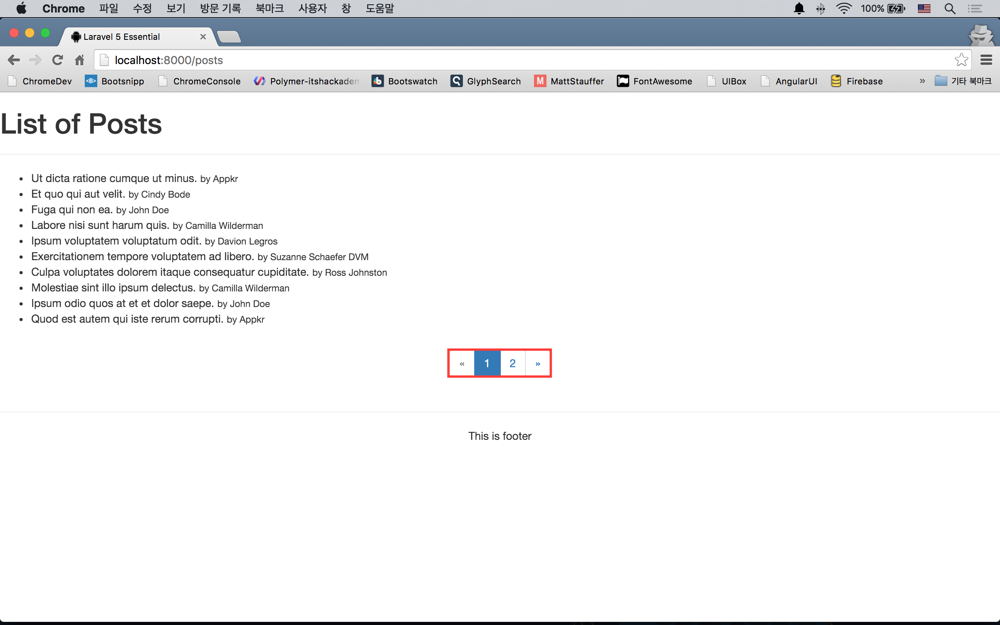

# 페이징

모델에 데이터가 많아지면 한번에 모든 레코드를 표시할 수가 없게 된다. 이때 필요한 것이 페이징이다.

## 페이징된 콜렉션 만들기

app/Http/routes.php 에 아래와 같이 Route를 써 보자. 모델에 대한 쿼리 끝에 `get()` 이나 `find()` 대신, `paginate()` 메소드를 체인하면 페이징을 위한 준비 완료! 인자는 한번에 반환할 Collection 갯수를 넣는다. 이 예제에서는 10개로 했다.

```php
Route::get('posts', function() {
    $posts = App\Post::with('user')->paginate(10);

    return view('posts.index', compact('posts'));
});
```

## 페이징된 결과 보기

라라벨 페이징은 [twitter bootstrap](http://getbootstrap.com/)과 완벽하게 호환된다. 확인을 위해 resources/views/master.blade.php 에 bootstrap 사용을 선언하자.

```html
<head>
  ...
  <link rel="stylesheet" href="https://maxcdn.bootstrapcdn.com/bootstrap/3.3.5/css/bootstrap.min.css">
</head>
```

20강에서 사용하던 resources/views/posts/index.blade.php 를 그대로 사용하자. `@stop` 바로 전에 아래 코드를 추가하자.  `paginate()` 메소드를 체임함으로써, `$posts` 객체는 페이징이 가능한 Paginator 인스턴스로 변경되었고 `render()` 메소드를 쓸 수 있게 된 것이다. 렌더링된 뷰에서 소스보기를 해서 어떤 코드가 추가되었는 지 확인해 보자.

```html
...
  @if($posts)
    <div class="text-center">
      {!! $posts->render() !!}
    </div>
  @endif
@stop
```


<!--@start-->
---

- [목록으로 돌아가기](../readme.md)
- [20강 - Eager 로딩](20-eager-loading.md)
- [21강 - 메일 보내기](21-mail.md)
<!--@end-->