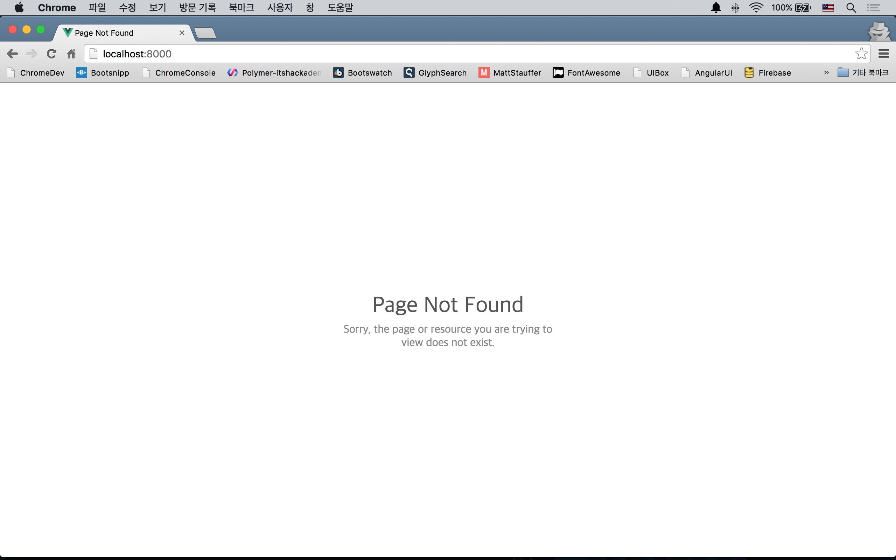

# 24강 - 예외 처리

## 예외 던지기

라라벨에서 예외(Exception)는 컨트롤러 또는 서비스 로직을 수행하는 도중 어디서든 던질 수 있다. app/Http/routes.php를 이용하여, 예외를 던지는 방법은 실습해 보자.

```php
Route::get('/', function() {
    throw new Exception('Some bad thing happened');
});
```

'/' Route로 접근해서 Whoops 페이지를 확인해 보자. `throw new My\Name\Space\CustomException('message');` 처럼 자신만의 Exception 클래스를 만들어서 던질 수도 있다. 

**`참고`** Production 환경에서는 보안을 위해 Stack Trace가 모두 찍히는 DEBUG 옵션을 꺼야 한다. .env 파일에서 `APP_ENV=production`, `APP_DEBUG=false`로 바꾼 후 '/' Route를 다시 방문해 보자. 웹 서버를 재시작해야 변경 내용을 확인할 수 있다.

또 다른 방법은 `abort(404)` 처럼, `abort(int $code, string $message)` Helper Function을 이용하는 방법이다. `abort()`는 `HttpException` 을 던진다. 

## 예외를 캐치하자.

라라벨에서는 `try{} catch($e){}` 로 싸지 않아도, 글로벌 하게 예외를 잡아준다. 바로 app/Exceptions/Handler.php 가 주인공이다. 클래스를 살펴보자.

```php
class Handler extends ExceptionHandler
{
    protected $dontReport = [];

    public function report(Exception $e) {}

    public function render($request, Exception $e) {}
}
```

`$dontReport` 속성에는 `report()` 메소드를 타지 않을 예외 클래스들의 리스트를 정의한다.

`report()` 메소드는 기본적으로 로그 (storage/logs/laravel.log)에 예외의 내용을 쓴다. 여기서 관리자 이메일, 슬랙, BugSnag와 같은 외부 서비스에 예외 내용 등을 리포트하는 로직을 더 구현해 넣을 수 있다.

`render()` 메소드에서는 예외를 Http 응답으로 렌더링하는 로직들을 포함한다.

## 예외를 처리하자.

app/Exceptions/Handler.php의 `render()` 메소드에 아래 내용을 추가해 보자. `ModelNotFoundException` 이 발생하면 지정된 뷰를 내용으로 하는 HTTP 404 응답을 반환하라는 의미이다.
 
```php
class Handler extends ExceptionHandler
{
    public function render($request, Exception $e)
    {
        if ($e instanceof \Illuminate\Database\Eloquent\ModelNotFoundException) {
            return response(view('errors.notice', [
                'title'       => 'Page Not Found',
                'description' => 'Sorry, the page or resource you are trying to view does not exist.'
            ]), 404);
        }

        return parent::render($request, $e);
    }
}
```

`Handler@render()` 메소드에서 뷰로 리턴할 resources/views/errors/notice.blade.php 뷰를 만들자.

```html
<!DOCTYPE html>
<html lang="en">
<head>
  <meta charset="utf-8">
  <title>{{ $title }}</title>
  <meta name="viewport" content="width=device-width, initial-scale=1, user-scalable=no">
  <style>
    * { line-height: 1.5; margin: 0; }
    html { color: #888; font-family: sans-serif; text-align: center; }
    body { left: 50%; margin: -43px 0 0 -150px; position: absolute; top: 50%; width: 300px; }
    h1 { color: #555; font-size: 2em; font-weight: 400; }
    p { line-height: 1.2; }
    @media only screen and (max-width: 270px) {
      body { margin: 10px auto; position: static; width: 95%; }
      h1 { font-size: 1.5em; }
    }
  </style>
</head>
<body>
<h1>{{ $title }}</h1>

<p>{{ $description }}</p>
</body>
</html>
```

routes.php 에서 `ModelNotFoundException`을 발생시키자. 해당 예외는 엘로퀀트 모델에 존재하지 않는 인스턴스를 쿼리했을 때 발생한다. 브라우저에서 '/' Route를 방문하여 렌더링 된 결과를 확인하자.

```php
Route::get('/', function() {
    return App\Post::findOrFail(100);
});
```



<!--@start-->
---

- [목록으로 돌아가기](../readme.md)
- [23강 - 입력 값 유효성 검사](23-validation.md)
- [25강 - 컴포저](25-composer.md)
<!--@end-->
