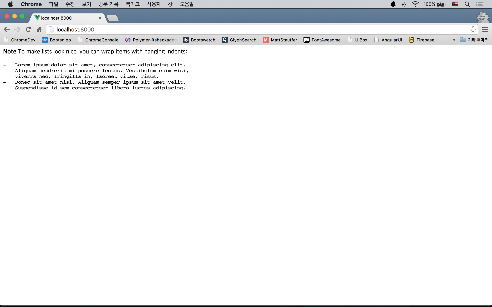

# 25강 - 컴포저

2강에서 라라벨 5 처음 설치할 때 Composer를 설치했을 것이다. 그땐 무엇인지 모르고 마냥 썼을 수도 있지만, 이제 그 정체를 조금만 핥아 보자. Composer는 php의 패키지 매니저이다. 패키지 레지스트리는 [패키지스트](https://packagist.org/)라 불린다. Java에 Maven, Python에 PyPi, Ruby에 Gem, Node에 Npm이 있다면, php엔 Composer가 있다. 라라벨도 버전 4로 넘어가면서 Composer를 본격적을 도입하고, 코어 프레임웍과 외부 패키지로 분리했다.

작은 서비스를 개발할 때는 패키지를 관리하는 일이 필요없지만, 서비스가 커질 수록 패키지 관리의 필요성은 급증한다. 급기야 **패키지를 관리하지 않아서, 개발자들이 패키지에 의해서 관리 당해지는 웃지 못할 사태**가 벌어질 수 있다. 패키지 매니저를 쓸 때 개인적으로 좋은 점을 정리해 봤다.

- 기억력을 보조한다 (레지스트리 역할).
- 이미 만들어진 바퀴를 쉽게 가져다 쓰고, 모양을 약간 바꾸어 쓸 수도 있다 (Code Reuse). 
- 외부 패키지들은 버전 관리에서 빠지기 때문에 코드 풋프린트가 줄어들고 Git에 푸시 할 때 빠르다.
- 외부 패키지들의 업데이트를 자동화할 수 있다. 즉, 일일이 확인하고, 다운로드하고, 설치해 줄 필요 없다.

## 시나리오

어느 날 고객사에서 기존에 개발한 블로그 서비스에 Markdown 기능을 추가해 달라는 요청을 했다고 가정해 보자. 구글링을 통해 여러 패키지들을 검토해 본 후 여러 CMS들이 쓰고 있다는 말에 낚여서 `erusev/parsedown-extra` 을 쓰기로 했다고 가정하자.

**`참고`** Markdown 은 과거의 위키 문법 처럼 빠른 글쓰기는 지원하는 초경량 마크업 도구이다. 지금 보는 이 문서들이 모두 Markdown 으로 작성되었고, Github가 컴파일해 주는 것이다.

## 패키지를 설치해 보자.

```bash
$ composer require "erusev/parsedown-extra: 0.7.*" 
# 버전 없이 쓸 때는 따옴표를 안쳐도 된다.
# 버전 앞에 ':' 대신 '='를 쓸 수도 있다.
```

꽤 오랜 시간이 걸릴 것이다 :(. 프로젝트 디렉토리에 위치한 composer.json을 열어서 `require` 섹션에 엔트리가 정상적으로 업데이트된 것을 확인하자.

```json
{
    "...": "...",
    "require": {
        "php": ">=5.5.9",
        "laravel/framework": "5.1.*",
        "erusev/parsedown-extra": " 0.7.*"
    },
    "...": "...",
}
```

**`참고`** 프로젝트 디렉토리에 위치한 composer.json 파일을 열고, `require` 섹션에 필요한 패키지를 직접 추가해 준 후, `$ composer update` 코맨드를 실행하는 방법으로도 설치할 수 있다.

**`참고`** 라라벨 전용으로 만들어진 패키지의 경우에는 설치 후, Service Provider, Facade, 설정 파일 발행 등 해당 패키지 사용을 더 편리하게 사용하기 위한 추가적인 작업이 필요할 수 있다. 해당 패키지의 Github 또는 Packagist 페이지의 설명을 참조하자.

**`참고`** 0.7.*은 0.7로 시작하는 버전 중 가장 최신 버전이란 의미이다. 모든 필드와 규칙을 설명할 수 없으므로, [공식 문서](https://getcomposer.org/doc/) 또는 XE팀에서 번역한 [한글본](https://xpressengine.github.io/Composer-korean-docs/)을 참조하자.

## 패키지를 이용해 보자.

app/Http/routes.php 를 이용하자.

```php
Route::get('/', function() {
    $text =<<<EOT
**Note** To make lists look nice, you can wrap items with hanging indents:

    -   Lorem ipsum dolor sit amet, consectetuer adipiscing elit.
        Aliquam hendrerit mi posuere lectus. Vestibulum enim wisi,
        viverra nec, fringilla in, laoreet vitae, risus.
    -   Donec sit amet nisl. Aliquam semper ipsum sit amet velit.
        Suspendisse id sem consectetuer libero luctus adipiscing.
EOT;

    return app(ParsedownExtra::class)->text($text);
});
```

서버를 부트업하고 '/' Route를 방문해 보자. Html로 잘 포맷팅 된 문서를 보고 있으면 성공한 것이다.



입력 문자열로 긴 스트림을 쓰기 위해서 [Heredoc](http://php.net/manual/kr/language.types.string.php#language.types.string.syntax.heredoc) 문법을 사용하였다. 실전에서는 POST 로 넘겨 받은 폼 데이터의, 가령 'body' 필드 값일 것이며, `Input::get('body')/Request::input('body')`로 값을 얻어 올 수 있을 것이다.

설치한 `erusev/parsedown`의 [Github 페이지](https://github.com/erusev/parsedown)를 참고하여 사용법을 익혔다. 이 패키지는 `namespace`를 쓰지 않아 Root 네임스페이스에 존재한다. 인스턴스를 생성하고, `text()` 메소드에 컴파일할 문자열들을 넘겨 주었다. 실전에서는 컴파일 된 결과를 뷰의 데이터로 바인딩하거나, `markdown()`과 같은 커스텀 Helper Function을 만들어 뷰에서 직접사용하면 된다.

여기서 주목할 만한 것은, `app()` 이란 Helper Function의 등장이다. 이는 `new ParsedownExtra()`와 같은 역할을 한다고 보면 된다. `app()` 을 쓰는 것이 `new` 키워드를 쓰는 것 보다 더 좋은 점은 `ParsedownExtra` 클래스의 생성자에 주입되는 다른 인스턴스가 있다면(의존성 주입), `app()`의 경우 자동으로 주입을 해 준다. 다시 설명하면, `new` 키워드를 썼을 때에 꼭 해야 하는, 아래 예와 같이 복잡한 의존성 주입이 필요없다는 얘기다. 이는 라라벨의 Service Container 의 기능인데, 이 코스의 범위를 벗어난다 생각되므로, [공식 문서](http://laravel.com/docs/container)를 참조하기 바란다.

```php
$sb = new SkateBoard(new Roller(new Wheel, new Joint), new Plate);
$sb->run();
```

## 어디에 어떤 패키지가 있는 지 어떻게 알아요?

유용성, 인기도, 완성도 측면에서 검증되어 큐레이션된 패키지 들이 있는 곳을 소개한다. 필요한 기능이 있다면 직접 만들려 하지 말고, 이 목록을 탐색하고 구글링해 보자.

- [ziadoz/awesome-php](https://github.com/ziadoz/awesome-php)
- [chiraggude/awesome-laravel](https://github.com/chiraggude/awesome-laravel)
- [TimothyDJones/awesome-laravel](https://github.com/TimothyDJones/awesome-laravel)

> **`참고`** 컴포저를 사용하다 보면, 아래와 같은 메시지를 만나는 경우가 있다. Github 에 정해진 시간당 요청할 수 있는 한도를 초과했다는 의미인데, 메시지를 자세히 보면 답이 있다. 제시한 URL 로 이동하여 토큰을 만들고, 복사하여 'Token(hidden):' 에 붙여 넣으면 끗! 
> Could not fetch https://api.github.com/repos/sebastianbergmann/global-state/zipball/bc37d50fea7d017d3d340f230811c9f1d7280af4, please create a GitHub OAuth token to go over the API rate limit.  
> Head to https://github.com/settings/tokens/new?scopes=repo&description=xxx to retrieve a token. It will be stored in "/home/vagrant/.composer/auth.json" for future use by Composer.  
> Token (hidden):
<!--@start-->
---

- [목록으로 돌아가기](../readme.md)
- [24강 - 예외 처리](24-exception-handling.md)
<!--@end-->