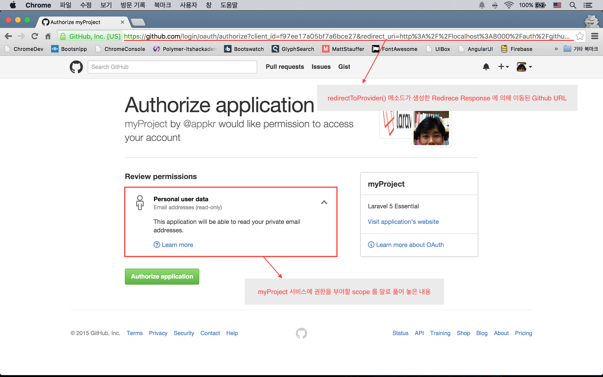
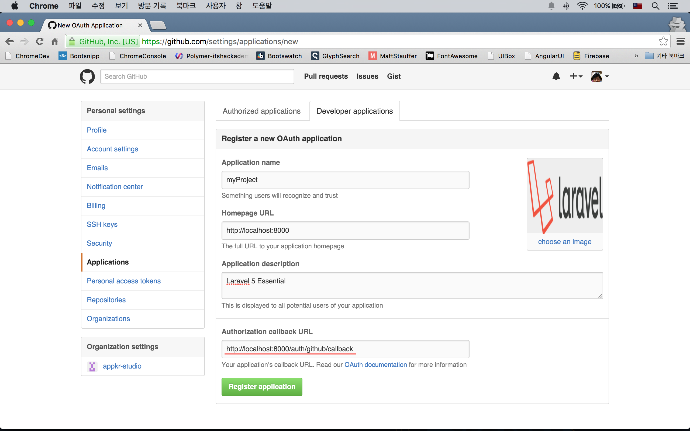
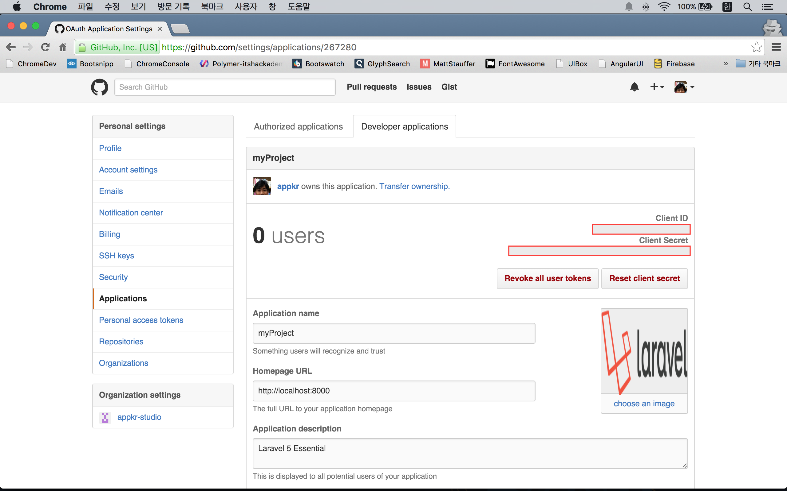
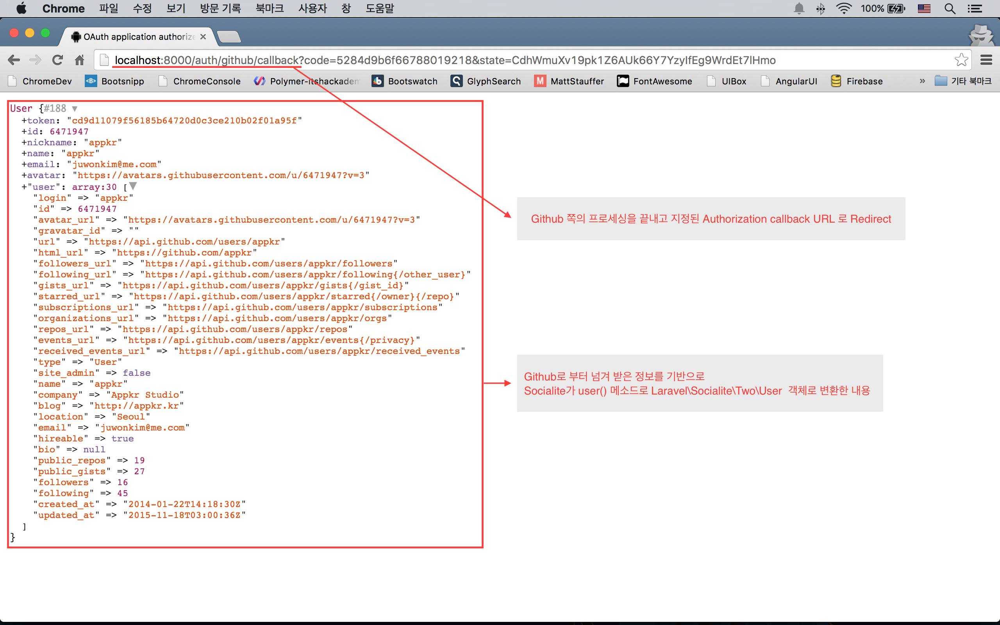
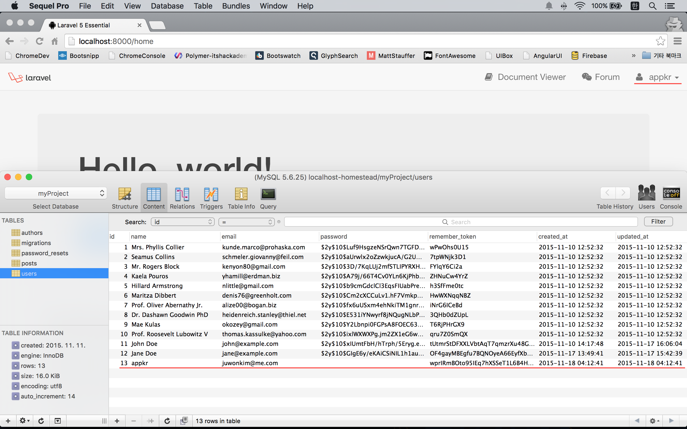
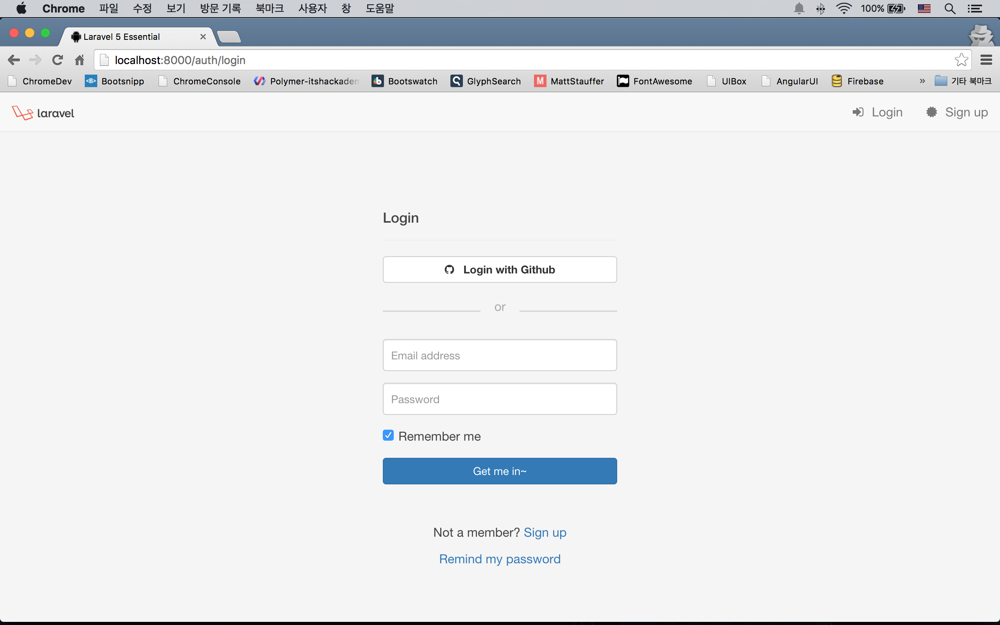

# 실전 프로젝트 2 - Forum

## 33강 - 소셜 로그인

소셜 로그인을 지원하지 않는 서비스는 구닥다리로 느껴진다. 소셜 로그인은 내 서비스에 들어 온 사용자의 신분확인을 제 3자에게 위탁(아웃소싱)하는 행위라 보면 되며, 기술적인 백그라운드는 Oauth 이다 (동작 시퀀스가 궁금하다면 [조대협님의 블로그](http://bcho.tistory.com/913)를 참조하자). 

간단히만 설명하자면... 내 서비스에서 사용자가 소셜로그인 버튼을 누르면, 우리 서비스('myProject'라 하자.)에 대한 여러가지 정보를 쿼리스트링으로 담고 소셜로그인 서비스 제공자의 페이지로 이동하게 된다. 표시된 UI 에서 사용자가 승인을 누르게 되는데, 이는 "내가 myProject 서비스에 이 소셜서비스의 권한을 위임해 줄게. 다는 안되고 UI 아래에 표시된 scope로 지정된 만큼만..." 의 의미이다. 즉 myProject는 소셜로그인 서비스를 통해 사용자의 신원을 확인하게 되는 과정인 것이다. 



이 코스에서는 github의 소셜로그인을 이용해 본다.

### Socialite 확장 기능

소셜로그인을 위한 구현체는 라라벨 기본 패키지에 포함되어 있지 않고 별도로 설치해야 한다.

```bash
$ composer require "laravel/socialite:2.0.*"
```

```php
// config/app.php
'providers' => [
    // Other service providers...
    Laravel\Socialite\SocialiteServiceProvider::class,
],

'aliases' => [
    // Other aliases...
    'Socialite' => Laravel\Socialite\Facades\Socialite::class,
]
```

### Oauth Credential 설정

[Github Developer Applications Console](https://github.com/settings/developers) 을 방문하여 'Register new application' 버튼을 눌러 아래 그림과 같이 정보를 입력하자. Authorization callback URL 은 'http://localhost:8000/auth/github/callback'으로 하자.





Application 등록이 완료되어 위 그림과 같은 등록정보 페이지를 확인할 수 있는데, 여기서 'Client ID'와 'Client Secret'를 복사하여, config/services.php 에 github 소셜로그인 정보를 셋팅한다. 물론 .env 파일에 넣고, `env()` Helper 로 읽어 오는 것이 정석이다.

```php
// config/services.php

return [
    // Other services setting
    
    'github' => [
        'client_id' => '복사한 Client ID',
        'client_secret' => '복사한 Client Secret',
        'redirect' => route('session.github.callback'),
    ],
];
```

### Route 정의

공식문서대로 구현하자. 대신 Route 이름을 주자.

```php
Route::group(['prefix' => 'auth', 'as' => 'session.'], function () {
    // Other route definitions...
    
    /* Social Login */
    Route::get('github', [
        'as'   => 'github.login',
        'uses' => 'Auth\AuthController@redirectToProvider'
    ]);
    Route::get('github/callback', [
        'as'   => 'github.callback',
        'uses' => 'Auth\AuthController@handleProviderCallback'
    ]);
});
```

### 컨트롤러 메소드 정의

app/Http/Controllers/Auth/AuthController.php 에 아래 메소드를 추가한다.

```php
class AuthController extends Controller
{
    ...
    
    public function redirectToProvider()
    {
        return \Socialite::driver('github')->redirect();
    }

    public function handleProviderCallback()
    {
        $user = \Socialite::driver('github')->user();

        dd($user);
    }
}
```

`redirectToProvider()` 메소드는 사용자가 소셜로그인 버튼을 눌렀을 때, Github 승인 페이지로 이동시켜주는 Redirect 응답을 만들어 준다. Github 쪽에서 모든 작업이 완료되면, 앞 절에서 우리가 설정한 Authorization callback URL로 Redirect 시키면서 Payload로 여러가지 정보들을 넘겨준다. 요청을 받은 `handleProviderCallbck()` 메소드는 Github 로 부터 넘겨 받은 Payload를 기반으로 `Laravel\Socialite\Two\User` 인스턴스를 만든다.
 
'http://localhost:8000/auth/github' 주소를 직접 쳐서 여기까지 테스트를 해 보자.
 


### 소셜 사용자 등록 및 로그인 처리

Github를 이용해서 로그인한 사용자를 우리 서비스의 사용자로도 등록시키자. 또, 세션을 만들어야 하므로, 로그인 처리도 하기 위해 `handleProviderCallback()` 메소드를 업데이트하자. 엘로퀀드 모델에서 `firstOrCreate()` 메소드는 인자로 주어진 정보와 일치하는 레코드가 있으면 반환하고, 없으면 새로 생성하는 역할을 한다.

```php
class AuthController extends Controller
{
    ...
    
    public function handleProviderCallback()
    {
        $user = \Socialite::driver('github')->user();

        $user = User::firstOrCreate([
            'name'  => $user->getName(),
            'email' => $user->getEmail(),
        ]);

        auth()->login($user, true);

        return redirect(route('home'));
    }
```

'http://localhost:8000/auth/github' 주소를 직접 쳐서 여기까지 테스트를 해 보자.
 


**`참고`** Github 사용자의 경우, 현재는 비밀번호가 없기 때문에 네이티브 로그인 기능으로 로그인할 수 없다. users 테이블에 소셜로그인으로 생성된 사용자에 대한 유효성을 표시하는 플래그를 만들고, 로그인 이메일은 맞는데 비밀번호가 없고 소셜 로그인 유효성 플래그가 있는 경우, 비밀번호를 추가로 받아 네이티브로도 로그인할 수 있게 하는 등의 기능 확장은 /각/자/ 해 보자. 또, Github 뿐만 아니라, 여러 소셜 로그인 공급자를 등록할 수 있도록 Social 모델을 만들어서 User 모델과 연결시키는 수준의 기능확장도 /각/자/ 도전해 보자.

### 소셜 로그인 버튼 추가

사용자가 Github 를 이용해 우리 서비스에 로그인할 수 있도록 로그인 페이지에 버튼을 달아 주자.

```html
@section('style')
  <style>
    /* 딱 이 페이지에서만 필요한 스타일링이 있어 여기에 정의했다. */
    /* 뭘 했는지는 코드를 살펴보자. */
  </style>
@stop

@section('content')
  <form action="{{ route('session.store') }}" method="POST" role="form" class="form-auth">

    {!! csrf_field() !!}

    <div class="page-header">
      <h4>Login</h4>
    </div>

    <div class="form-group">
      <a class="btn btn-default btn-block" href="{{ route('session.github.login') }}">
        <strong><i class="fa fa-github icon"></i> Login with Github</strong>
      </a>
    </div>
    
    ...
@stop
```



<!--@start-->
---

- [목록으로 돌아가기](../readme.md)
- [32강 - 사용자 로그인](32-login.md)
- [34강 - 사용자 역할](34-role.md)
<!--@end-->

 
 
