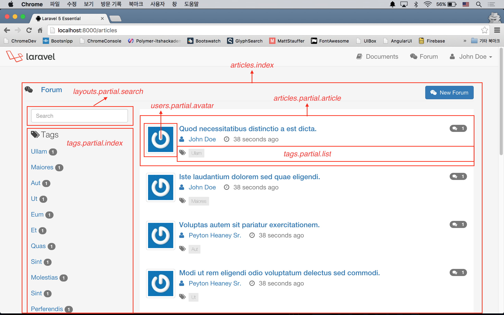
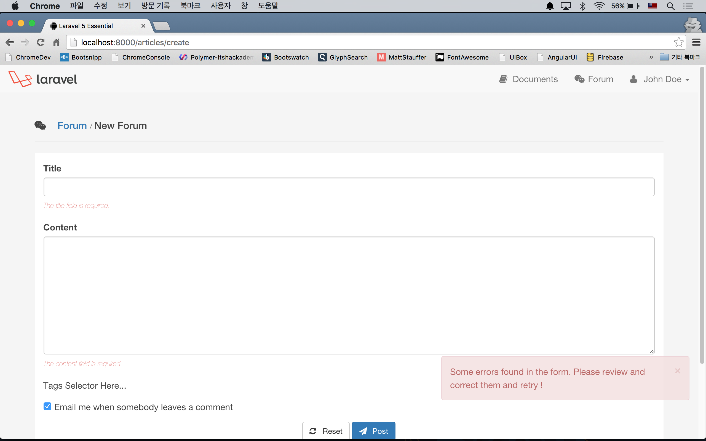
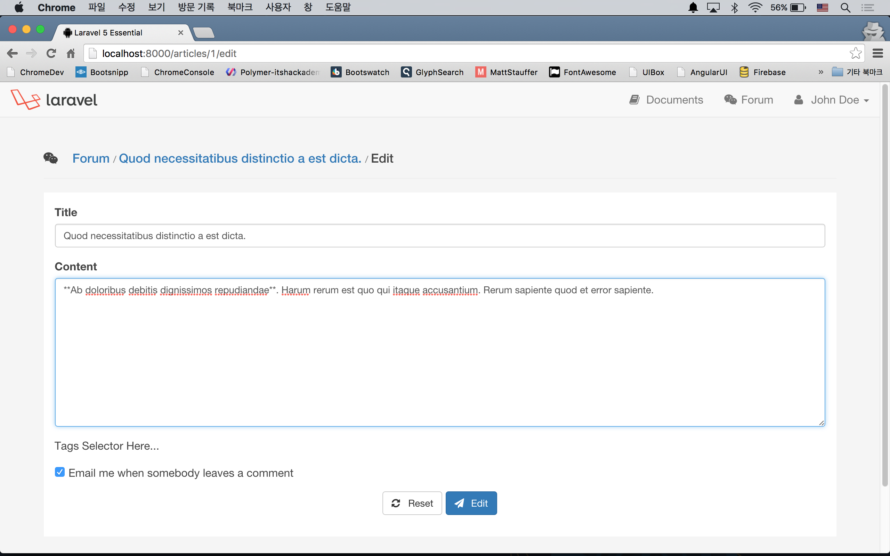

# 실전 프로젝트 2 - Forum

## 37강 - Article 기능 구현

이번 강좌를 통해 포럼의 핵심인 Article 기능을 구현할 것이다. 캐싱이나 이벤트 등은 나중에 다듬기로 하고, 컨트롤러와 뷰 위주로 작업을 해 보자. 

### Route 정의 및 컨트롤러 생성

RESTful 리소스 컨트롤러를 이용한다.

```php
// app/Http/routes.php

Route::resource('articles', 'ArticlesController');
```

```bash
$ php artisan make:controller ArticlesController
$ php artisan route:list
```

`index()`와 `show()` 메소드, 즉 포럼 목록 보기와 개별 포럼 상세 보기만 guest 에게 허용할 것이다. 그리고, 사이드바에 모든 태그 목록을 뿌리기 위해, [35강 - 다국어 지원](35-locale.md)에서 했던 것 처럼, `$allTags` 란 변수를 포럼을 위한 모든 뷰에 공유할 것이다.

```php
class ArticlesController extends Controller
{
    public function __construct()
    {
        $this->middleware('auth', ['except' => ['index', 'show']]);
        view()->share('allTags', \App\Tag::with('articles')->get());
        parent::__construct();
    }
}
```

### 목록 보기 구현

완성된 모양을 먼저 보자.



resources/views/articles/index.blade.php 는 포럼 목록을 보여주는 뷰이다. 크게 보면 Tag 를 보여주는 왼쪽 영역과, 목록을 보여주는 오른쪽 영역으로 구분된다. 왼쪽 영역에서는 검색 폼 (layouts/partial/search.blade.php) 과 전체 태그 목록(tags/partial/index.blade.php)을 블레이드 문법으로 `@include` 하고 있다. 오른쪽은 포럼 엔트리들을 표시하는데, 각 엔트리(articles/partial/article.blade.php)는 사용자의 [Gravatar](http://ko.gravatar.com/) (users/partial/avatar.blade.php)를 보여주는 영역과 각 Article과 연결된 태그의 목록(tags/partial/list.blade.php)을 보여주는 영역으로 구성되어 있다.

`ArticleController::index()` 메소드를 작성하자. Eager Loding 으로 'comments', 'author', 'tags' 관계를 포함하고, `paginate()` 메소드로 한번에 10개의 Article 인스턴스를 불러오도록 하였다.

```php
use App\Article;

class ArticlesController extends Controller
{
    public function index()
    {
        $articles = Article::with('comments', 'author', 'tags')->latest()->paginate(10);

        return view('articles.index', compact('articles'));
    }
}
```
 
위에 나열한 뷰들을 작성하자. 레이아웃 관련된 내용들은 각자 입맛에 맞게 작성하도록 하자.
 
```html
<!-- resources/views/articles/index.blade.php -->

@extends('layouts.master')

@section('content')
  <div class="page-header">
    ...
  </div>

  <div class="row container__forum">
    <div class="col-md-3 sidebar__forum">
      <aside>
        @include('layouts.partial.search')
        @include('tags.partial.index')
      </aside>
    </div>

    <div class="col-md-9">
      <article>
        @forelse($articles as $article)
          @include('articles.partial.article', ['article' => $article])
        @empty
          <p class="text-center text-danger">{{ trans('errors.not_found_description') }}</p>
        @endforelse

        <div class="text-center">
          {!! $articles->appends(Request::except('page'))->render() !!}
        </div>
      </article>
    </div>

  </div>
@stop
```

하위 뷰에 데이터를 넘겨 줄 때는, `@include('articles.partial.article', ['article' => $article])` 식으로 넘긴다는 것을 익혀 두자. 

`{{ $articles->appends(Request::except('page'))->render() }}` 는 나중에 Url 뒤에 여러 개의 쿼리스트링이 붙을 것을 대비해, 미리 `appends()` 메소드를 이용해서 page 쿼리를 빼고 나머지들은 모두 붙이도록 했다. 가령, GET /articles?solved=0 요청의 페이징 링크는 /articles?solved=0&page=1, /articles?solved=0&page=2 와 같은 식으로 생성된다.

```html
<!-- resources/views/layouts/partial/search.blade.php -->

<form action="#" method="get" role="search">
  <input type="text" name="q" value="{{ Input::get('q') }}" class="form-control" placeholder="Search"/>
</form>
```

풀텍스트 검색 기능은 나중에 구현할 것이므로, 폼만 만들어 놓고 넘어가자.

```html
<!-- resources/views/tags/partial/index.blade.php -->
 
<p class="lead">
  {!! icon('tags') !!} Tags
</p>

<ul class="list-unstyled">
  @foreach($allTags as $tag)
    <li class="{{ (Route::current()->parameter('id') == $tag->id) ? 'active' : '' }}">
      <a href="#">
        {{ $tag->name }}
        @if ($tagCount = $tag->articles->count())
          <span class="badge badge-default">{{ $tagCount }}</span>
        @endif
      </a>
    </li>
  @endforeach
</ul>
```

`ArticlesController::__construct()` 에서 모든 뷰에 공유한 `$allTags` 변수를 여기서 이용한다.
 
'active' 클래스를 표시하기 위해 삼항 연산자를 이용하였고, `Route::current()->parameter('id')` 로 현재 요청의 Route 파라미터를 얻어 왔다. 아직 Route 가 정의되지 않았으므로 이 기능은 동작하지 않는데, 곧 고칠 것이다.

`$tagCount = $tag->articles->count()` 로 각 Tag 에 해당하는 Article 의 갯수를 구하고, 태그 이름 옆에 숫자로 표시하였다. `ArticlesController::__construct()` 에서 `$allTags` 변수에서 Eager Loading 을 한 이유가, 여기서 N + 1 쿼리 문제를 피하기 위해서였다.
 
 **`참고`** 태그 리스트를 포함한 왼쪽 영역은 여러 뷰에서 사용하므로, [뷰 컴포저](http://laravel.com/docs/views#view-composers)로 구성하면 더 깔끔하다. 이 코스 수준을 넘어서는 내용으로 각자 공부해서 적용해 보자. 

```html
<!-- resources/views/articles/partial/article.blade.php -->
 
<div class="media">
  @include('users.partial.avatar', ['user' => $article->author])

  <div class="media-body">
    <h4 class="media-heading">
      <a href="{{ route('articles.show', $article->id) }}">
        {{ $article->title }}

        @if ($commentCount = $article->comments->count())
          <span class="badge pull-right">
            {!! icon('comments') !!} {{ $commentCount }}
          </span>
        @endif

        @if ($article->solution_id)
          <span class="badge pull-right">
            {!! icon('check') !!} {{ trans('forum.solved') }}
          </span>
        @endif
      </a>
    </h4>

    <p class="text-muted">
      <a href="{{ gravatar_profile_url($article->author->email) }}" style="margin-right: 1rem;">
        {!! icon('user') !!} {{ $article->author->name }}
      </a>
      {!! icon('clock') !!} {{ $article->created_at->diffForHumans() }}
    </p>

    @include('tags.partial.list', ['tags' => $article->tags])
  </div>
</div>
```

`@include('users.partial.avatar', ['user' => $article->author])` 로, `$user` 변수를 사용자 사진을 표시할 하위 뷰에 데이터를 넘겨 준다. 

`$commentCount = $article->comments->count()` 로,  각 Article에 연결된 Tag 의 갯수를 구하고, Article 제목 옆에 갯수를 표시하였다. 

기본기 강좌에서 'created_at', 'updated_at'은 `Carbon\Carbon` 인스턴스라고 얘기한바 있다. `$article->created_at->diffForHumans()` 메소드를 쓰면 '6 hours ago' 처럼 Article 생성 시각을 표시할 수 있다.

`@include('tags.partial.list', ['tags' => $article->tags])` 로, 각 Article 인스턴스에 연결된 Tag 의 목록을 넘겨 준 것을 기억해 놓자.

```html
<!-- resources/views/users/partial/avatar.blade.php -->

@if ($user)
  <a class="pull-left hidden-xs hidden-sm" href="{{ gravatar_profile_url($user->email) }}">
    email, 64) }}" alt="{{ $user->name }}">
  </a>
@else
  <a class="pull-left hidden-xs hidden-sm" href="{{ gravatar_profile_url('john@example.com') }}">
    
  </a>
@endif
```

`gravatar_profile_url()`, `gravatar_url()` Helper를 이용하여, 사용자의 프로파일 주소와 아바타를 가져왔다. 이 Helper들은 다음 섹션에서 구현할 것이다. 로그인한 사용자만 포럼을 남길 수 있게 조치했으므로, `$user` 변수가 없을 가능성은 없다. `$user = null` 인 경우를 대비해, 미리 조심해서 나쁠 것은 없다. 

```html
<!-- resources/views/tags/partial/list.blade.php -->

@if ($tags->count())
  <span class="text-muted">{!! icon('tags') !!}</span>
  <ul class="tags__forum">
    @foreach ($tags as $tag)
      <li class="label label-default">
        <a href="#">{{ $tag->name }}</a> </li>
    @endforeach
  </ul>
@endif
```

'articles/partial/article.blade.php' 에서 넘겨 받은 `$tags` 변수를 이용하여, 각 Article 에 연결된 Tag 들의 이름을 뿌려준다. 링크 href 속성에 '#'로 표시된 부분은 나중에 다시 업데이트할 것이다.

#### Gravatar Helper

```php
// app/helpers.php

function gravatar_profile_url($email)
{
    return sprintf("//www.gravatar.com/%s", md5($email));
}

function gravatar_url($email, $size = 72)
{
    return sprintf("//www.gravatar.com/avatar/%s?s=%s", md5($email), $size);
}
```

```bash
$ php artisan tinker
>>> gravatar_url('juwonkim@me.com');
=> "//www.gravatar.com/avatar/6a7346bbad52884566008892003fc6ac?s=72"
```

's' 쿼리는 가져올 아바타 이미지의 사이즈를 의미한다.

### 상세 보기 구현

목록에서 Article 엔트리의 제목을 누르면 'GET /articles/{id}' 로 넘어가도록 목록 보기 뷰에서 링크를 걸었다. 이 Route 에 해당하는 `ArticlesController::show()` 메소드를 작성하자.

```php
class ArticlesController extends Controller
{
    public function show($id)
    {
        $article = Article::with('comments', 'author', 'tags')->findOrFail($id);

        return view('articles.show', compact('article'));
    }
}
```

앞에서 작업을 많이 했기에 'articles/show.blade.php' 는 의외로 간단하다. Article 인스턴스의 'content' 속성값을 뿌리기 위해, 이전에 만든 `markdown()` Helper를 이용하였다.
 
```html
<!-- resources/views/articles/show.blade.php -->

@extends('layouts.master')

@section('content')
  <div class="page-header">
    ...
  </div>

  <div class="row container__forum">
    <div class="col-md-3 sidebar__forum">
      <aside>
        @include('layouts.partial.search')
        @include('tags.partial.index')
      </aside>
    </div>

    <div class="col-md-9">
      <article>
        @include('articles.partial.article', ['article' => $article])

        <p>
          {!! markdown($article->content) !!}
        </p>
      </article>
      ...
      <article>
        Comment here
      </article>
    </div>
  </div>
@stop
```

'Comment here' 라고 된 부분이 보일 것이다. 여기에 댓글 작성 폼과, 그간 작성된 댓글 목록이 표시될 것이다.


 
### 포럼 쓰기 구현

#### 쓰기 UI 구현

새 포럼 글을 쓰는 UI는 목록 보기 뷰나 상단의 네비게이션 메뉴에 위치하면 적절할 것 같다.

```html
<!-- resources/views/articles/index.blade.php -->

<div class="page-header">
  <a class="btn btn-primary pull-right" href="{{ route('articles.create') }}">
    {!! icon('forum') !!} {{ trans('forum.create') }}
  </a>
  ...
</div>
...
```

#### 쓰기 폼 구현

포럼을 쓰기 위한 폼을 만들자.

```php
// app/Http/Controllers/ArticlesController

public function create()
{
    $article = new Article;

    return view('articles.create', compact('article'));
}
```

`$article = new Article;` 부분은 create 와 edit 뷰에서 폼을 공용으로 사용하기 위한 편법이다. 뒤에 나오는 공용 폼에서 `<input type="text" ... value="{{ old('title', $article->title) }}"/>` 에서 edit 뷰에서는 Article 인스턴스가 바인딩되지만, create 뷰에는 바인딩되지 않기 때문에 'Undefined variable: article' 에러가 난다. `old()` Helper 에서 세션에 `$title` 값이 있으면 쓰고, 없으면 `$article->title`로 폴백하라는 의미이다. 

```html
<!-- resources/articles/create.blade.php -->

@extends('layouts.master')

@section('content')
  <div class="page-header">
    ...
  </div>

  <div class="container__forum">
    <form action="{{ route('articles.store') }}" method="POST" role="form" class="form__forum">
      {!! csrf_field() !!}

      @include('articles.partial.form')

      <div class="form-group">
        <p class="text-center">
          <a href="{{ route('articles.create') }}" class="btn btn-default">
            {!! icon('reset') !!} Reset
          </a>
          <button type="submit" class="btn btn-primary my-submit">
            {!! icon('plane') !!} Post
          </button>
        </p>
      </div>
    </form>
  </div>
@stop
```

`@include('articles.partial.form')` 은 포럼 수정하기에서도 동일하게 사용되는 폼이므로 하위 뷰로 뺐다.

```html
<!-- resources/articles/partial/form.blade.php -->

<div class="form-group">
  <label for="title">{{ trans('forum.title') }}</label>
  <input type="text" name="title" id="title" class="form-control" value="{{ old('title', $article->title) }}"/>
  {!! $errors->first('title', '<span class="form-error">:message</span>') !!}
</div>

<div class="form-group">
  <label for="content">{{ trans('forum.content') }}</label>
  <textarea name="content" class="form-control" rows="10">{{ old('content', $article->content) }}</textarea>
  {!! $errors->first('content', '<span class="form-error">:message</span>') !!}
</div>

<div class="form-group">
  @include('articles.partial.tagselector')
</div>

<div class="form-group">
  <div class="checkbox">
    <label>
      <input type="checkbox" name="notification" checked="{{ $article->notification ?: 'checked' }}">
      {{ trans('forum.notification') }}
    </label>
  </div>
</div>
```

`@include('articles.partial.tagselector')`, 나중에 포럼을 작성/수정할 때 태그를 선택하는 UI를 추가할 것이다. 여유가 된다면, 'content' 필드에 쓴 내용을 마크다운으로 미리보기하는 기능도 추가해 볼 것이다.



#### 저장 로직 구현

기본기 강좌의 [23강 - 입력 값 유효성 검사](23-validation.md)에서는 다루지 않았는데, 여기서는 [Form Request](http://laravel.com/docs/validation#form-request-validation) 를 사용하여 사용자의 입력값 유효성 검사를 할 것이다.

```bash
$ php artisan make:request ArticlesRequest
```

```php
// app/Http/Requests/ArticlesRequest.php

class ArticlesRequest extends Request
{
    public function authorize()
    {
        return true;
    }

    public function rules()
    {
        return [
            'title'   => 'required',
            'content' => 'required',
        ];
    }
}
```

`authorize()` 메소드에서 `false` 를 반환하면, 403 Forbidden 응답이 떨어진다. 우선은 `true`를 반환하자.

`rules()` 메소드에서 각 필드별로 검사할 규칙을 정의한다. 여기서는 'required' 만 이용했다.

```php
// app/Http/Controllers/ArticlesController.php

use App\Http\Requests\ArticlesRequest;

class ArticlesController extends Controller
{
    public function store(ArticlesRequest $request)
    {
        $article = Article::create($request->all());
        flash()->success(trans('forum.created'));
        
        return redirect(route('articles.index'));
    }
}
```

`store()` 메소드에 원래 있던 `Illuminate\Http\Request` 대신, 방금 만든 `App\Http\Requests\ArticlesRequest` 을 주입했다. 우리가 만든 Form Request는 원래있던 Request 객체를 상속하고 있고, 거기다 유효성 검사 기능을 추가한 것이다. Form Request 는 미들웨어와 유사한 기능을 하고 있는데, 우리가 만든 Form Request를 통과하지 못하면, `store()` 메소드는 전혀 실행되지 않는다. 

`flash()` 메소드는 [32강 - 사용자 로그인](32-login.md) 에서 설치한 'laracasts/flash' 패키지에 포함된 Helper로, `success()`, `error()` 등에 메소드를 체인해서 사용할 수 있다. 

Tag UI 가 준비되면, 유효성 검사 로직과 저장 로직을 다시 손 볼 것이다.

### 포럼 수정 구현

#### 수정 UI 구현

수정 및 삭제 UI는 주로 목록 보기 또는 상세 보기에서 접근할 수 있다. 여기서는 상세 보기 뷰에서 구현한다. 

```html
<!-- resources/articles/show.blade.php -->

<article>
...
  <p class="text-center">
    <a href="{{route('articles.edit', $article->id)}}" class="btn btn-info">
      {!! icon('pencil') !!} Edit 
    </a>
  </p>
</article>
```

#### 수정 폼 구현

쓰기 폼에서 공용 폼을 만들었기에 한결 간편해 졌다.

```php
// app/Http/Controllers/ArticlesController.php

public function edit($id)
{
    $article = Article::findOrFail($id);

    return view('articles.edit', compact('article'));
}
```

```html
<!-- resources/articles/edit.blade.php -->

@extends('layouts.master')

@section('content')
  <div class="page-header">
    ...
  </div>

  <div class="container__forum">
    <form action="{{ route('articles.update', $article->id) }}" method="POST" role="form" class="form__forum">
      {!! csrf_field() !!}
      {!! method_field('PUT') !!}

      @include('articles.partial.form')

      <div class="form-group">
        <p class="text-center">
          <a href="{{ route('articles.edit', $article->id) }}" class="btn btn-default">
            {!! icon('reset') !!} Reset
          </a>
          <button type="submit" class="btn btn-primary">
            {!! icon('plane') !!} Edit
          </button>
        </p>
      </div>
    </form>
  </div>
@stop
```

`{!! method_field('PUT') !!}` 는 [13강 - RESTful 리소스 컨트롤러](13-restful-resource-controller.md) 에서 설명한 메소드 오버라이드를 위한 숨김 필드를 생성해 주는 Helper 로, `<input type="hidden" name="_method" value="PUT">` 태그를 생성한다.

#### 수정 로직 구현

포럼 쓰기에서 만든 FormRequest를 그대로 사용하자.

```php
// app/Http/Controllers/ArticlesController.php

public function update(ArticlesRequest $request, $id)
{
    $article = Article::findOrFail($id);
    $article->update($request->except('_token', '_method'));
    flash()->success(trans('forum.updated'));

    return redirect(route('articles.index'));
}
```



### 포럼 삭제 구현

#### 삭제 UI 구현

일반적으로 삭제는 Ajax 요청을 이용하는데, 여기서는 전통적인 폼 요청을 통해서 하도록 하자.

```html
<!-- resources/articles/show.blade.php -->

...
  <div class="text-center">
    <form action="{{ route('articles.destroy', $article->id) }}" method="post">
      {!! csrf_field() !!}
      {!! method_field('DELETE') !!}
      <button type="submit" class="btn btn-danger">
        {!! icon('delete') !!} Delete
      </button>
      <a href="{{route('articles.edit', $article->id)}}" class="btn btn-info">
        {!! icon('pencil') !!} Edit
      </a>
    </form>
  </div>
</article>
```

#### 삭제 로직 구현

```php
// app/Http/Controllers/ArticlesController.php

public function destroy($id)
{
    Article::findOrFail($id)->delete();
    flash()->success(trans('forum.deleted'));

    return redirect(route('articles.index'));
}
```

### 접근 제어 (Authorization)

상세 보기에서 관리자이거나 사용자 자신이 작성한 포럼만 수정하거나 삭제할 수 있도록 할 것이다. [34강 - 사용자 역할](34-role.md) 에서 설치한 'bican/roles' 패키지가 밥값을 할 차례이다... 라고 생각하고, 이용하려고 했으나 뭔가 여의치 않다. 

해서 User 와 Article 모델에 Helper 메소드를 만들었다. 어쨌든, 뷰에서 접근을 제한하여 버튼 UI 자체가 표시되지 않게 하는 게 우선이고...
 
```php
// app/User.php

public function isAdmin()
{
    return $this->roles()->whereSlug('admin')->exists();
}
```

```php
// app/Article.php

public function isAuthor()
{
    return $this->author->id == auth()->user()->id;
}
```

```html
<!-- resources/articles/show.blade.php -->

  @if (auth()->user()->isAdmin() or $article->isAuthor())
  <div class="text-center">
    <form ...>
      <button ...>Delete</button>
    </form>
    <a ...>Edit</a>
  @endif
</article>
```

다음은 CURL 코맨드 등을 이용하여 직접 Route 에 접근하는 것을 막아야 한다. 이를 위해 Route 미들웨어를 만들고, app/Http/Kernel.php 에 Route 미들웨어라고 등록할 것이다.

```bash
$ php artisan make:middleware CanAccessArticle
```

```php
// app/Http/Middleware/CanAccessArticle.php

class CanAccessArticle
{
    public function handle($request, Closure $next)
    {
        $user = $request->user();
        $articleId = $request->route('articles');

        if (! \App\Article::whereId($articleId)->whereAuthorId($user->id)->exists() and ! $user->isAdmin()) {
            flash()->error(trans('errors.forbidden') . ' : ' . trans('errors.forbidden_description'));

            return back();
        }

        return $next($request);
    }
}
```

`Illuminate\Http\Request` 인스턴스에서는 `user()` 메소드를 사용할 수 있으며, `auth()->user()` 와 동일한 결과를 얻을 수있다. 로그인한 사용자 id와 Route 파라미터로 넘겨 받은 Article id로 Article 모델을 검색하여 레코드가 있으면, 작성자이므로 통과시켜 주는 식이다.

**`참고`** 미들웨어에서 Route를 통해 사용자로부터 넘겨 받은 파라미터를 이용할 수 있다. [미들웨어 파라미터](http://laravel.com/docs/middleware#middleware-parameters)를 잘 이용하면, Article 모델 뿐 아니라 여러 모델에 적용할 수 있는 미들웨어를 만들수 있을 것이다.

```php
// app/Http/Kernel.php

protected $routeMiddleware = [
    // Other Route Middlewares ...
    'accessible' => \App\Http\Middleware\CanAccessArticle::class,
];
```

컨트롤러에서 미들웨어를 등록하자. 미들웨어는 순차적으로 실행되므로 반드시 'auth' 미들웨어 다음에 정의되어야 한다. 이유는 사용자 로그인을 먼저 걸러주고 난 이후에, 이 사용자가 해당 Route와 컨트롤러 메소드에 접근할 수 있는 지 체크하는 식이다. 

```php
// app/Http/Controllers/ArticlesController.php

public function __construct()
{
    ...
    $this->middleware('accessible', ['except' => ['index', 'show', 'create']]);
}
```

#### 테스트

artisan CLI의 tinker 코맨드로 사용자의 비밀번호를 수정하자.

```bash
$ php artisan tinker
>>> $user = App\User::find(2);
>>> $user->password = bcrypt('password');
>>> $user->save();
```

1번과 2번 사용자로 번갈아 로그인한 후 구현한 내용이 잘 동작하는 지 확인해 보자.
<!--@start-->
---

- [목록으로 돌아가기](../readme.md)
- [36강 - 마이그레이션과 모델](36-models.md)
- [38강 - Tag 기능 구현](38-tags.md)
<!--@end-->