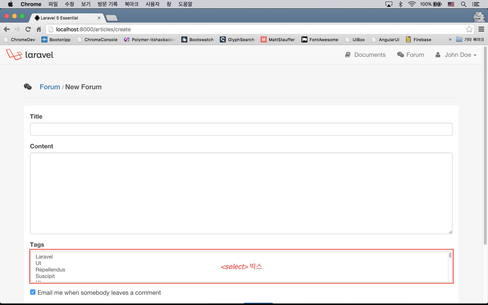
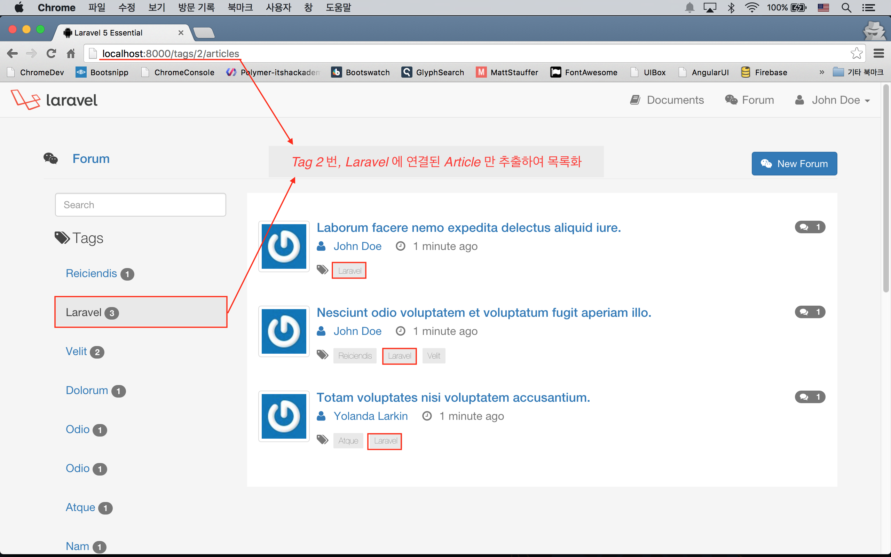

# 실전 프로젝트 2 - Forum

## 38강 - Tag 기능 구현

이번 강좌에서는 37강에서 구현하던 포럼의 Article 기능에 Tag 기능을 더할 것이다. 

### 태그 선택 UI 구현

`ArticlesController::__construct()` 에서 뷰에 공유한 `$allTags` 변수를 이용하여, `<select>` 태그를 만든다.

```html
<!-- resources/views/articles/partial/tagselector.blade.php -->

<div class="form-group">
  <label for="tags">{{ trans('forum.tags') }}</label>
  <select class="form-control" multiple="multiple" id="tags" name="tags[]">
    @foreach($allTags as $tag)
      <option value="{{ $tag->id }}" {{ in_array($tag->id, $article->tags->lists('id')->toArray()) ? 'selected="selected"' : '' }}>{{ $tag->name }}</option>
    @endforeach
  </select>
  {!! $errors->first('tags', '<span class="form-error">:message</span>') !!}
</div>
```

앞서 보았다시피, 이 뷰는 'create' 와 'edit'에서 공통으로 사용하는 'resources/views/articles/partial/form.blade.php' 의 하위 뷰이다. 코드가 좀 지저분 한데, 삼항 연산자로 각 `<option>` 태그에 'selected' 속성을 표시하는 연산을 하고 있다.

'form.blade.php' 에서 `@include('articles.partial.tagselector')` 로 'tagselector' 뷰를 하위로 포함하면서 `$article` 변수를 넘겨주지 않았다. 부모 뷰에서 `$article` 변수가 유효하기에 자식 뷰에서도 쓸 수 있는 것이다. `@include` 되는 뷰에서 쓸 변수와 같은 변수이면, `['varAtSubView' => $currentVar]` 식으로 변수 이름을 바꿀 필요가 없다는 것을 기억하고 있자.



**`참고`** [Laravel Collective의 Form Helper](http://laravelcollective.com/docs/5.1/html#drop-down-lists)를 이용하면, 복잡한 `<select>` 박스를 좀 더 쉽게 쓸 수 있다. 바로 아래 코드 블럭을 보면, 여전히 복잡하긴 하지만, 그래도 코드량을 상당히 줄일 수 있다는 것을 알 수 있다. 

```html
<div class="form-group">
  {!! Form::label('tags', trans('forum.tags')) !!}
  {!! Form::select('tags', $allTags, old('tags', $article->tags->lists('id')->toArray()), ['multiple' => 'multiple', 'class' => 'form-control'])}}
  {!! $errors->first('tags', '<span class="form-error">:message</span>') !!}
</div>
```

### 컨트롤러 구현

#### 유효성 검사 보강

37강에서 'tags' 필드에 대해서는 유효성 검사를 수행하지 않았다. 여기서 추가한다.

```php
// app/Http/Requests/ArticlesRequest.php

public function rules()
{
    return [
        // Other Validation Rules...
        'tags'    => 'required|array'
    ];
}
```

#### 기존 컨트롤러 로직의 문제점 확인

앞선 37강에서 `$request->all()`로 모든 폼 데이터를 Article 엘로퀀트 모델의 `create()` 메소드에 인자로 넣었다. 이 때 'notification' 필드가 문제가 된다.

```php
// app/Http/Controllers/ArticlesController.php

public function store(ArticlesRequest $request)
{
    dd($request->all());
}
```

`dd()` Helper 로 확인해 보면 아래와 같이 찍힌다. 코드를 찾아보면, 'articles' 테이블 마이그레이션에서 `$table->boolean('notification')->default(1);` 처럼 정의했었다. "on" 과 같은 string 값을 받을 수 없고, 0|1 만 받을 수 있다.

```php
array:4 [▼
  "_token" => "QCfBxat0DDhVi06rb3aMmaTRfz6uxnvm1Dbp6i0v"
  "title" => "..."
  "content" => "..."
  "notification" => "on"
]
```

#### 컨트롤러 보강

위 문제점의 수정을 포함해서, `ArticlesController::store()`, `ArticlesController::update()` 메소드에서 UI 에서 전달한 'tags[]' 필드를 받고, Article 모델과 Tag 모델간의 관계를 지정하는 코드를 작성하도록 하자.

```php
// app/Http/Controllers/ArticlesController.php

public function store(ArticlesRequest $request)
{
    $payload = array_merge($request->except('_token'), [
        'notification' => $request->has('notification')
    ]);

    $article = $request->user()->articles()->create($payload);
    $article->tags()->sync($request->input('tags'));
    flash()->success(trans('forum.created'));

    return redirect(route('articles.index'));
}

...

public function update(ArticlesRequest $request, $id)
{
    $payload = array_merge($request->except('_token'), [
        'notification' => $request->has('notification')
    ]);

    $article = Article::findOrFail($id);
    $article->update($payload);
    $article->tags()->sync($request->input('tags'));
    flash()->success(trans('forum.updated'));

    return redirect(route('articles.index'));
}
```

`$request->has(string $key)` 는 폼 데이터에 '$key' 값이 있는 기 검사한 후, true/false 를 반환한다. 2 개의 메소드에 중복된 부분들이 많이 보이지만, 설명의 복잡성을 피하기 위해 손대지 않았다.

**`참고`** 엘로퀀트 모델에서 [Mutator](http://laravel.com/docs/eloquent-mutators#accessors-and-mutators) 를 쓸 수 있다. 이를 이용하면 컨트롤러에서 `'notification' => $request->has('notification')` 와 같이 데이터 변환을 하지 않아도, 모델이 생성되는 시점에서 `Article::$notification` 속성 값을 boolean 으로 바꾸어 놓을 수 있다.

### 미려한 UI

좀 Off Topic 이긴하지만, 나이스한 태그 선택 UI를 위해, [select2 jQuery 플러그인](https://select2.github.io/)을 설치하고 사용할 것이다.

```bash
$ bower install select2 --save-dev
```

메인 Sass 파일에 select2 의 스타일시트를 @import 한다.

```css
/* resources/assets/sass/app.scss */

@import "../vendor/font-awesome/scss/font-awesome";
@import "../vendor/select2/src/scss/core";
// ...
```

Gulp 빌드 태스크에 select2 의 JS 파일을 포함한다.

```javascript
// gulpfile.js

elixir(function (mix) {
  mix
    .scripts([
      // Other Files...
      '../vendor/select2/dist/js/select2.js',
      'app.js'
    ], 'public/js/app.js')
    // Other Scripts...
});
```

빌드하자.

```bash
$ gulp # 또는 gulp --production
```

이제 `layouts.master` 를 상속하는 모든 뷰에서 select2 JS 인스턴스에 접근할 수 있다. 우리는 포럼 쓰기, 수정 폼에서만 사용할 것이고, 폼은 공용으로 빼 놓았고, 그 폼은 다시 tagselector.blade.php 를 `@import` 하므로.. 한 곳에서만, 즉 'tagselector.blade.php' 에서만 select2 를 활성화 시키는 스크립트를 쓰면 된다. 

```html
<!-- resources/views/articles/partial/tagselector.blade.php -->

...

@section('script')
  <script>
    $("select#tags").select2({
      placeholder: "{{ trans('forum.tags_help') }}",
      maximumSelectionLength: 3
    });
  </script>
@stop
```

'placeholer', 'maximumSelectionLength' 등, select2 JS 인스턴스의 옵션은 [공식문서](https://select2.github.io/examples.html)를 참조하자.


### 태그 링크 살리기

#### Route 정의

포럼 목록 보기에서 왼쪽의 태그 리스트에서 태그 이름을 누르면, 해당 태그에 속하는 포럼 글 목록만 보여 주게 할 것이다. 'GET /tags/1/articles' 와 같은 Url 요청이 들어오면 Tag 1번에 연결된 Article 목록을 보여줄 것이다.

```php
// app/Http/routes.php

Route::get('tags/{id}/articles', [
    'as'   => 'tags.articles.index',
    'uses' => 'ArticlesController@index'
]);
Route::resource('articles', 'ArticlesController');
```

#### 컨트롤러 작성

기존에 만든 `ArticlesController@index` 를 사용할 것이므로, 약간의 분기가 필요하다. 'GET /tags/{id}/articles' 에서는 id 파라미터가 있고, 'GET /articles' 에서는 없다는 것에 착안하자. (또는 Route 이름으로 분기할 수도 있을 것이다.)

```php
// app/Http/Controllers/ArticlesController.php

public function index($id = null)
{
    $query = $id
        ? Tag::find($id)->articles()
        : new Article;

    $articles = $query->with('comments', 'author', 'tags')->latest()->paginate(10);

    return view('articles.index', compact('articles'));
}
```

#### 뷰 수정

Tag 와 관련된 뷰는 'resources/views/tags' 아래에 위치하고 있다. Named Route 를 썼으므로 `route()` Helper를 이용하여 링크를 살려줄 수 있다.

```html
<!-- resources/views/tags/partial/index.blade.php -->

...
<ul ...>
  @foreach($allTags as $tag)
    <li class="{{ (Route::current()->parameter('id') == $tag->id) ? 'active' : '' }}">
      <a href="{{ route('tags.articles.index', $tag->id) }}">
        ...
      </a>
    </li>
  @endforeach
</ul>
```

```html
<!-- resources/views/tags/partial/list.blade.php -->

...
<ul ...>
  @foreach ($tags as $tag)
    <li ...>
      <a href="{{ route('tags.articles.index', $tag->id) }}">{{ $tag->name }}</a>
    </li>
  @endforeach
</ul>
```



<!--@start-->
---

- [목록으로 돌아가기](../readme.md)
- [37강 - Article 기능 구현](37-articles.md)
- [39강 - Attachment 기능 구현](39-attachments.md)
<!--@end-->
