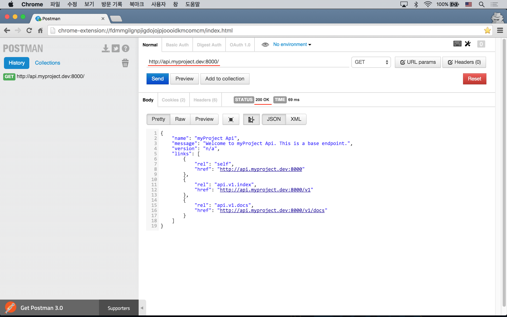
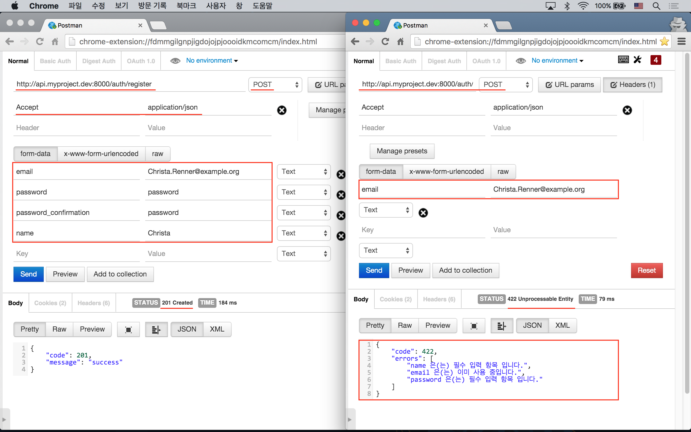

# 실전 프로젝트 3 - RESTful API

## 45강 - 기본 구조 잡기

앞 강좌에서 기획한 내용을 가장 잘 수용할 수 있는 기본 구조를 잡아보자. 한 방에 완벽할 수는 없기에, 진행하면서 구조는 변경될 수도 있음을 감안하자.

### 단일 서버 vs. 복수 서버

대형 서비스의 경우, API 를 위해 물리적으로 분리된 별도의 서버를 두고, 데이터베이스를 공유하는 식의 아키텍처를 사용하기도 한다. 예를 들면, 서버 A 에 HTML 뷰와 RedirectResponse 를 응답하는 라라벨 어플리케이션을 구동하고, 서버 B 에 API 요청에 응답하는 라라벨 어플리케이션을 두는 식이다. 이 구조에서는 데이터 무결성 확보 등 신경 쓸 일이 굉장히 많아진다.

이 실전 프로젝트에서는 단일 서버, 단일 라라벨 프레임웍을 사용하되, API 를 위한 엔트포인트만 별도의 도메인인 `api.myproject.dev` 로 분리하도록 하자. 

### 도메인 설정

앞서 얘기했듯이 `myproject.dev` 와 `api.myproject.dev` 란 도메인을 만들어 보자. 실제로 도메인 서비스에 등록하는 것은 아니고, 로컬에서 'hosts' 파일을 변경하도록 하자. 

**`참고`** 가령, 사용자가 'http://api.example.com/v1/articles' 란 인터넷 Resource 를 요청하면, DNS 에서 IP 주소로 번역하는 과정을 거쳐 컴퓨터간에 통신을 하게 된다. 그런데, 운영체제에 포함된 'hosts' 파일은 DNS 로 요청이 나가기 전에 낚아 채는 역할을 한다. 즉 'hosts' 파일 안에 사용자가 요청한 도메인에 해당하는 레코드가 있으면 정의된 IP 주소로 이동시켜 주는 기능을 한다.

```bash
# Mac/Linux
$ sudo nano /etc/hosts

# Windows (코맨드프롬프트를 관리자 권한으로 실행해야 한다.)
\> notepad %SystemRoot%\System32\drivers\etc\hosts
```

```bash
# /etc/hosts

127.0.0.1   myproject.dev
127.0.0.1   api.myproject.dev

# ctrl + x, Y, Enter 순으로 변경 내용 저장
# Homestead 를 쓰신다면, 192.168.10.10 으로 해 주어야 한다.
```

로컬 서버를 띄우는데, 이전과는 명령이 달라졌으니 잘 기억해 두자.

```bash
$ php artisan serve --host=myproject.dev
```

브라우저를 열고 'http://myproject.dev:8000' 으로 접근해서 앞 강좌에서 개발한 페이지가 보이는 지 확인하자.

### Routing

도메인이 만들어 졌으니 신나게 Routing 을 정의해 보자. `Route::group()` 의 첫번째 배열 인자 안에 `domain`, `namespace` 를 썼다. `domain` 에 매칭되는 요청이 들어오면 이 Routing 블럭이 응답하게 된다. `Route::group()` 내부에서 컨트롤러를 연결시킬 때 매번 `'Api\WelcomeController@index'` 식으로 네임스페이스를 붙여주어야 하는 번거로움을 덜기 위해, `namespace` 라는 키워드를 사용한다.

`$domain` 이란 변수를 사용하고, 도메인 이름을 '.env' 파일의 `API_DOMAIN` 값으로 지정했는데, 이는 프로덕션으로 배포할 때 Route 를 고쳐서 배포해야 하는 번거로움을 피하기 위해서다.

`Route::group()` 안에 또 다른 `Route::group()` 이 중첩되어 있다. 두번 째 `Route::group()` 은 'http://api.myproject.dev:8000/v1' 요청에 응답하기 위한 것이다. 여기서도 `namespace => 'V1'` 을 정의하고 있다.

```php
// app/Http/routes.php

$domain = env('API_DOMAIN', 'api.myproject.dev');

Route::group(['domain' => $domain, 'namespace' => 'Api'], function() {
    Route::get('/', [
        'as'   => 'api.index',
        'uses' => 'WelcomeController@index'
    ]);
    
    Route::group(['prefix' => 'v1', 'namespace' => 'V1'], function() {
        /* Landing page */
        Route::get('/', [
            'as'   => 'api.v1.index',
            'uses' => 'WelcomeController@index'
        ]);
    ]);
}

// 기존 Routing ...
Route::get('/', [
    'as'   => 'index',
    'uses' => 'WelcomeController@index',
]);
```

사용자 인증을 위한 Routing 들인, 'auth/register', 'social/{provider}', 'auth/login', 'auth/logout', 'auth/remind' 들도 정의하도록 하자. 유의할 점은 API 클라이언트와 데이터만으로 통신을 하기 때문에, 뷰를 반환하는 Route 는 필요없다는 점이다. 그리고, 비밀번호 초기화 기능에서는 사용자의 이메일 주소를 받아서 Reset 토큰을 메일로 보내는 Route 만 제공하고, 그 이후 프로세스는 API 클라이언트와 분리된 메일 클라이언트에서 이루어 지므로 Route 를 제외 했다.

### 컨트롤러

앞 절에서 봤듯이 `Api` 란 네임스페이스를 이용하고 있다. 'app/Http/Controllers/Api' 디렉토리를 만들자. 방금 만든 디렉토리에 기존에 만들었던 'WelcomeController.php' 를 복사하고 아래와 같이 내용을 변경하자.

'/v1' 요청에 응답하기 위한 'WelcomeController.php' 도 'app/Http/Controllers/Api/V1' 디렉토리 아래에 만들도록 하자.

```php
// app/Http/Controllers/Api/WelcomeController.php

<?php

namespace App\Http\Controllers\Api;

use App\Http\Controllers\Controller;

class WelcomeController extends Controller
{
    public function index()
    {
        return response()->json([
            'name'    => 'myProject Api',
            'message' => 'Welcome to myProject Api. This is a base endpoint.',
            'version' => 'n/a',
            'links'   => [
                [
                    'rel'  => 'self',
                    'href' => route(\Route::currentRouteName())
                ],
                [
                    'rel'  => 'api.v1.index',
                    'href' => route('api.v1.index')
                ],
            ],
        ]);
    }
}
```

브라우저로 테스트를 해도 되는데, API 이니까 [PostMan 크롬 확장 프로그램](https://chrome.google.com/webstore/detail/postman/fhbjgbiflinjbdggehcddcbncdddomop) 을 이용하자. 'GET http://api.myproject.dev:8000' 요청을 해 보자. 현재 컨트롤러는 무조건 JSON 만 응답하기 때문에 `Accept` HTTP 헤더는 필요없지만, 좋은 습관이니 `application/json` 으로 지정하도록 하자. 



### DRY 구조 설계

DRY (==Don't Repeat Yourself) 는 코드의 재사용을 의미한다. 

우리는 컨트롤러를 재활용할 것이다. 잘 생각해 보면, 기존에 개발한 컨트롤러 로직에서 API 서비스를 위해 변경되어야 하는 부분은 HTTP 응답 부분 뿐이다. 기존 컨트롤러에서는 뷰 (`\Illuminate\Contracts\View\Factory`) 또는 Redirect (`\Illuminate\Http\RedirectResponse`) 를 응답했다면, API 컨트롤러들에서는 JSON 응답(`\Illuminate\Http\JsonResponse`)를 반환하는 부분만 달라진다. 그래서, 기존 컨트롤러에서 뷰 또는 Redirect 를 응답하는 부분을 별도 메소드로 빼내고, API 컨트롤러들은 기존 컨트롤러를 일대일로 상속받되 응답 메소드만 오버라이드하면 깔끔할 것 같다. 

**`참고`** PHP 에서는 오버로딩을 지원하지 않는다. 오버로딩은 부모 메소드와 같은 이름을 가지지만, 인자도 다를 수 있고 내부에서 완전히 다른 동작을 하고 그 결과를 반환하는 반면, 오버라이드는 인자의 타입과 갯수가 부모와 정확히 같아야 하고, 내부의 동작만 다른 것을 의미한다. 대신 PHP에서는 반환값에 대한 타입 정의가 없어서 부모를 오버라이드한 자식 클래스의 메소드에서 반환값의 타입을 다르게 쓸 수 있다.  

#### abstract 컨트롤러

기존 컨트롤러들이 상속을 받고 있는 abstract 컨트롤러인 `App\Http\Controllers\Controller` 에서 뷰에 공용 변수를 셋팅하는 부분은 Api 컨트롤러에서는 필요 없다.

```php
// app/Http/Controllers/Controller.php

abstract class Controller extends BaseController
{
    public function __construct() {
        if (! is_api_request()) {
            $this->setSharedVariables();
        }
    }

    // ...
}
```

`is_api_request()` 란 Helper 는 쓰일 일이 많을 것 같아서 만들었다.

```php
// app/helpers.php

function is_api_request()
{
    return starts_with(Request::getHttpHost(), env('API_DOMAIN'));
}
```
 
#### 기존 컨트롤러 리팩토링

기존 컨트롤러에서 뷰 또는 Redirect 를 응답하는 부분을 메소드로 추출 (==Extract) 해 내자. 'routes.php' 에 정의한 대로 오늘 강좌의 대상이 되는 컨트롤러는 `UsersController`, `SocialController`, `SessionsController`, `PasswordsController` 등이다. 몇 개만 같이 살펴보고, 나머지는 코드를 참조하기 바란다.
   
```php
// app/Http/Controllers/UsersController.php

namespace App\Http\Controllers;

class UsersController extends Controller
{
    protected function syncAccountInfo(Request $request, User $user)
    {
        // ...

        if ($validator->fails()) {
            return $this->respondValidationError($validator);
        }

        // ...

        return $this->respondCreated($user);
    }
    
    protected function respondValidationError(Validator $validator)
    {
        return back()->withInput()->withErrors($validator);
    }

    protected function respondCreated(User $user)
    {
        \Auth::login($user);
        flash(trans('auth.welcome', ['name' => $user->name]));

        return redirect(route('home'));
    }
}
```

```php
// app/Http/Controllers/Api/UsersController.php

namespace App\Http\Controllers\Api;

class UsersController extends ParentController
{
    protected function respondValidationError(Validator $validator)
    {
        return response()->json([
            'code' => 422,
            'errors' => $validator->errors()->all()
        ], 422);
    }

    protected function respondCreated(User $user)
    {
        // Todo 로그인 하는 대신 JSON Web Token 을 응답할 것이다.
        return response()->json([
            'code' => 201,
            'message' => 'success',
            'token' => 'token here',
        ], 201);
    }
}
```



대충 감이 잡히는가? 하나만 더 살펴 보자.

```php
// app/Http/Controllers/SessionsController.php

namespace App\Http\Controllers;

class SessionsController extends Controller
{
    public function store(Request $request)
    {
        // ...
        
        if ($validator->fails()) {
            return $this->respondValidationError($validator);
        }

        // API 에서는 쿠키를 이용한 세션 유지 (로그인)을 하지 않기에
        // attempt() 메소드를 쓰지 않고 once() 메소드를 이용하였다.
        $valid = is_api_request()
            ? Auth::once($request->only('email', 'password'))
            : Auth::attempt($request->only('email', 'password'), $request->has('remember'));

        if (! $valid) {
            return $this->respondLoginFailed(trans('auth.failed'));
        }

        event('users.login', [Auth::user()]);

        return $this->respondCreated($request->input('return'));
    }
    
    public function destroy()
    {
        Auth::logout();
        flash(trans('auth.goodbye'));

        return redirect(route('index'));
    }
    
    protected function respondValidationError(Validator $validator)
    {
        return back()->withInput()->withErrors($validator);
    }

    protected function respondLoginFailed($message)
    {
        flash()->error($message);

        return back()->withInput();
    }

    protected function respondCreated($return = '')
    {
        flash(trans('auth.welcome', ['name' => Auth::user()->name]));

        return ($return) ? redirect(urldecode($return)) : redirect()->intended();
    }
}
```

```php
// app/Http/Controllers/Api/SessionsController.php

namespace App\Http\Controllers\Api;

class SessionsController extends ParentController
{
    public function destroy()
    {
        // Todo JSON Web Token 을 지울 것이다. 
        return response()->json([], 204);
    }

    protected function respondValidationError(Validator $validator)
    {
        return response()->json([
            'code' => 422,
            'errors' => $validator->errors()->all()
        ], 422);
    }

    protected function respondLoginFailed($message)
    {
        return response()->json([
            'code' => 401,
            'errors' => $message
        ], 401);
    }

    protected function respondCreated($return = '')
    {
        // Todo 로그인 하는 대신 JSON Web Token 을 응답할 것이다.
        return response()->json([
            'code' => 201,
            'message' => 'success',
            'token' => 'token here',
        ], 201);
    }
}
```

대충 보기에도, `respondValidationError()`, `respondCreated()` 등등 엄청난 중복이 보인다. 앞으로 진행될 강좌에서 중복들은 제거할 것이다. 

### CSRF

사용자 인증을 위해 JSON Web Token 을 사용할 것이다. 앞으로 곧 보겠지만, 모든 API 요청의 HTTP 헤더에는 `Authorization: Bearer {header.payload.signature}` 형태의 JWT 를 붙여서 보내야 하고, 이를 통해 사용자를 인식할 뿐 아니라, CSRF 와 같은 악의적인 공격으로 부터 방어할 것이다. 바꾸어 말하면 API 에서 CSRF 토큰 사용은 적절하지 않다. 왜일까 잘 생각해 보면, API 에서는 HTML 뷰를 서버에서 내려 주지 않기 때문에 서버에서 생성된 CSRF 토큰을 전달할 방법이 없다.

역시 [13강 - RESTful 리소스 컨트롤러](13-restful-resource-controller) 에서, 특정 Route 에 대해서 글로벌 미들웨어로 등록된 CSRF 를, `$except = []` 속성을 이용해서 제외시키는 방법을 살펴본 바 있다. 그런데, 이번에는 조금 특수하다. 기존 Route 와 API Route 가 동일한 형태이기 때문이다. 가령 로그인의 경우 'http://myproject.dev:8000/auth/login', 'http://api.myproject.dev:8000/auth/login' 으로 Route 에 정의된 Path 는 동일하기 때문이다. 둘간에 서로 다른 부분은 도메인이라는 점에 착안해서, 필자는 아래 처럼 `BaseVerifier::handle()` 메소드에 기능을 추가하는 식으로 구현했다.
  
```php
// app/Http/Middlewares/VerifyCsrfToken.php

class VerifyCsrfToken extends BaseVerifier
{
    public function handle($request, Closure $next)
    {
        if (is_api_request()) {
            return $this->addCookieToResponse($request, $next($request));
        }

        return parent::handle($request, $next);
    }
}
```

<!--@start-->
---

- [목록으로 돌아가기](../readme.md)
- [44강 - API 기본기 및 기획](44-api-basic.md)
- [46강 - JSON Web Token 을 이용한 인증](44-jwt.md)
<!--@end-->