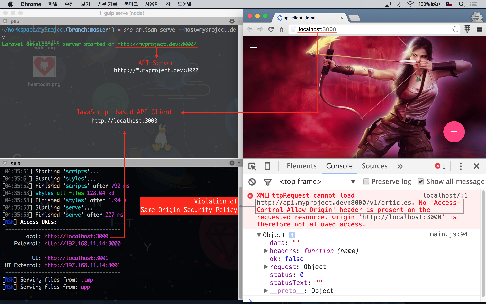
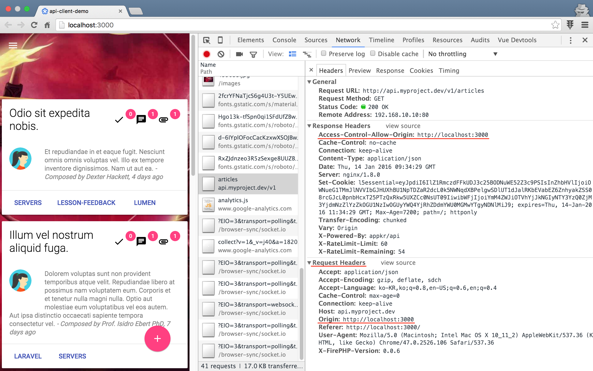
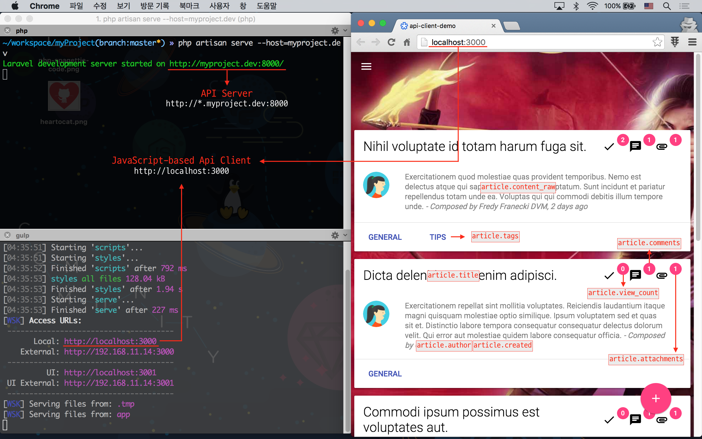

# 실전 프로젝트 3 - RESTful API

## 51강 - CORS

이번 강좌에서는 [CORS (Cross Origin Resource Sharing)](https://en.wikipedia.org/wiki/Cross-origin_resource_sharing) 에 대해 공부해 보자. 개념적으로는 굉장히 어려운 내용이지만, 해결 방법 자체는 엄청 간단하다. 

### CORS 란?

개념을 알고 넘어 가야 한다. 어려운 개념을 복잡하게 설명하면 고수가 아니다. 필자도 잘 모르기 때문에 딱 눈 높이에 맟추어 설명하자면... 

-   일단 CORS 이슈는 JavaScript 를 이용하는 API Client 에서만 발생한다. 

    Android, iOS 에서는 신경쓸 필요가 없다. 왜냐하면, 브라우저를 통한 Ajax (== `XMLHttpRequest`) 요청을 할 때는, Same Origin Security Policy 가 적용되기 때문이다. XSS (== Cross Site Script) 공격을 방지하기 위해, W3C 와 브라우저 벤더들이 그렇게 하기로 오래전에 약속했다.
    
-   Same Origin Security Policy (== 동일 출처 보안 정책) 란...

    foo.com 에서 동작하는 JavaScript 가 bar.com 에 있는 API 서버에 Ajax 요청을 할 수 없다는 것이다. 심지어 http://foo.com -> https://foo.com 뿐 아니라, http://foo.com -> http://foo.com:8080 도 동작하지 않는다. 왜냐하면, JavaScript 는 태생적으로 클라이언트에 다운로드 되어 사용되는 프로그램이기 때문이다. 즉, foo.com 에서 제공한 JavaScript 코드를 사용자가 임의로 변경할 수 있기 때문이다. 

아래 그림은 이번 강좌를 위해 개발한 JavaScript 기반의 [`appkr/api-client-demo`](https://github.com/appkr/api-client-demo) 코드를 http://localhost:3000 에서 구동하고, http://api.myproject.dev:8000 API 서버에 리소소를 요청하는 그림이다. 
 


JavaScript 기반의 SPA (== Single Page Application) 들이 계속 늘어나고 있고, 클라이언트와 서버는 API 로 데이터만 주고 받고, 뷰/UI 는 클라이언트 쪽에 모두 맡기는 것이 모던 웹 개발의 베스트 프렉티스라는 점을 감안한다면, API 서버를 개발하는 백엔드 개발자 입장에서 Same Origin Security Policy 문제는 반드시 해결해야 할 숙제이다. 

### 해결방안

여러가지 방법이 있다.

1.  `JSONP` 를 이용하는 방법. 

    Legacy 이다. CORS 이슈가 대두된게 10년이 넘었고, W3C 스펙이 확정된지 5년이 넘었다. 쓰면 안된다는 얘기다. 게다가 JSONP 는 HTTP GET 요청만 적용할 수 있다는 한계도 있다.
    
2.  Reverse Proxy 를 이용하는 방법. 

    Reverse Proxy (또는 L4) 가 클라이언트의 HTTP 요청을 보고, Reverse Proxy 내부에 위치한 web 또는 api 적절한 서버로 요청을 분기하는 방법이다. 클라이언트가 Reverse Proxy 주소로 요청하고, 서버오 Reverse Proxy 뒤에 있기에 문제가 발생하지 않는다. 다만, 자기 서비스에만 적용할 수 있다는 단점이 있다.
    
3.  HTTP `Options` Pre-flight Request 를 이용해 White-list 하는 방법. 

    클라이언트가 HTTP `OPTIONS` 요청을 먼저 한 후, 응답을 해석한 후, 본 요청을 해야 한다. 서버 쪽에서도 로직이 복잡하다.
    
4.  `Origin` 및 `Access-Control-*` HTTP 헤더를 이용하는 방법. 

우리는 가장 간단한 4 번 방법을 이용할 것이다.

### 패키지 설치

[`barryvdh/laravel-cors`](https://github.com/barryvdh/laravel-cors) 패키지를 이용할 것이다.

이 패키지가 의존하는 [`asm89/stack-cors`](https://github.com/asm89/stack-cors) 패키지의 Git Tagging 이 늦어, Composer 설치시 충돌이 발생한다. 우리는 아래와 같이 우회해서 설치할 것이다.

```javascript
// composer.json

{
  // ...
  
  "require": {
    // ...
    "asm89/stack-cors": "dev-master as 0.2.2",
    "barryvdh/laravel-cors": "^0.7.3"
  }
  
  // ...
}
```

```bash
$ composer update
```

공식 문서에 나온대로 ServiceProvider 를 활성화 해 준다.
 
```php
// config/app.php

return [
    // ...
    
    'providers' => [
        // ...
        Barryvdh\Cors\ServiceProvider::class,
    ],
    
    // ...
];
```

### CORS 기능 정합

서두에 구현이 굉장히 간단하고 얘기했다. `barryvdh/laravel-cors` 패키지를 설치하고 나면, `cors` 라는 별칭을 가진 Route Middleware 를 사용할 수 있다. API 에만 이 미들웨어를 적용할 것이므로 가장 적절한 위치는 Route 정의 파일인 듯 하다.

```php
// app/Http/routes.php

Route::group(['domain' => env('API_DOMAIN'), /* ... */, 'middleware' => 'cors'], function() {
    // ...
}
```

이걸로 끝이다.

**`참고`** Laravel 5.2 부터 Middleware Group 을 이용할 수 있다. 기본으로 `web`, `api` 두개의 그룹이 가용하다. 요는 여러개의 미들웨어를 모아 `api` 등의 별칭으로 한번에 적용할 수 있다는 것이다.

### 살펴 보기

설치한 `barryvdh/laravel-cors` 패키지와 `cors` 미들웨어는 어떤 일을 할까? 



JavaScript 클라이언트에서 Ajax 요청을 할 때 `Origin` HTTP Header 를 달아서 보내면, API 서버에서 응답할 때 `Access-Control-Allow-Origin` HTTP Header 를 내려주는 식이다. 그림을 보면, "JavaScript 엔진아! 나 API 서버인데... http://localhost:3000 은 나랑 scheme:://host:port 가 달라도 내가 허용해 줄라니까, Same Origin Security Policy 적용하지 말고 내 Client 한테 데이터 좀 넘겨 줘~" 라고 부탁하는 식이다. 왼쪽 클라이언트 화면을 보면, API 서버로 데이터를 받아 뷰를 정상적으로 렌더링한 것을 볼 수 있다. 요약하자면, `Origin` 요청 헤더를 검사하고, `Access-Control-*` 응답 헤더를 붙여 주는 역할을 한다. 

이 패키지는 `Access-Control-*` 헤더 방식을 이용한 CORS Handling 만 하는 것이 아니라, 앞서 언급한 Pre-flight 방식도 지원한다.

### api-client-demo

전체 코드는 [`appkr/api-client-demo`](https://github.com/appkr/api-client-demo) 에서 확인하기로 하자. 앞 강에서와 달리 [Vue.js](http://vuejs.org/) 프레임웍을 이용하고 있고, API 서버에 Ajax 요청을 하는 부분은 아래와 같다.

```javascript
// @appkr/api-client-demo
// app/scripts/main.js

(function(Vue, moment) {
  'use strict';

  var base = 'http://api.myproject.dev:8000';

  var vm = new Vue({
    el: '#demo',

    data: {
      articles: {}
    },

    ready: function() {
      var resource = this.$resource(base + '/v1/articles');

      resource.get('').then(function(response) {
        this.$set('articles', response.data.data);
      }, function(response) {
        console.log(response);
      });
    },

    filters: {
      // ...
    },

    http: {
      headers: {
        Accept: 'application/json'
      }
    }
  });
})(Vue, moment);
```

[`appkr/api-client-demo`](https://github.com/appkr/api-client-demo) 에서 뷰는 Bootstrap 대신 [Google Material Design Lite](http://www.getmdl.io/) 를 사용하고 있다. [Cordova](https://cordova.apache.org/) 를 이용하면 Android, iOS 모바일 앱으로도 패키징해서 사용해 볼 수 있다. 

```html
<!-- @appkr/api-client-demo -->
<!-- app/index.html -->

<!-- ... -->

<main class="mdl-layout__content">
  <div class="page-content" id="demo">
    <div v-for="article in articles" class="mdl-card ..."><!--repeat start-->
      <div class="mdl-card__title">
        <h2 class="mdl-card__title-text">
          {{ article.title }}
        </h2>
        <div class="mdl-layout-spacer"></div>
        <span class="material-icons mdl-badge" data-badge="{{ article.view_count }}">
          done
        </span>
        <span class="material-icons mdl-badge" data-badge="{{ article.comments }}" v-if="article.comments">
          chat
        </span>
        <span class="material-icons mdl-badge" data-badge="{{ article.attachments }}" v-if="article.attachments">
          attachment
        </span>
      </div>
      <div class="mdl-card__supporting-text">
        
        {{{ article.content_raw }}}
        <span class="composed-by">
          - Composed by {{ article.author.name }}, {{ article.created | formatDate }}
        </span>
      </div>
      <div class="mdl-card__actions mdl-card--border">
        <a class="mdl-button ..." v-for="tag in article.tags"> <!--sub repeat start-->
          {{ tag }}
        </a> <!--sub repeat end-->
      </div>
    </div> <!--repeat end-->
  
    <!-- ... -->
  
  </div>
</main>

<!-- ... -->
```



<!--@start-->
---

- [목록으로 돌아가기](../readme.md)
- [50강 - 리소스 id 난독화](lessons/50-id-obfuscation.md)
- [52강 - Caching](lessons/52-caching.md)
<!--@end-->