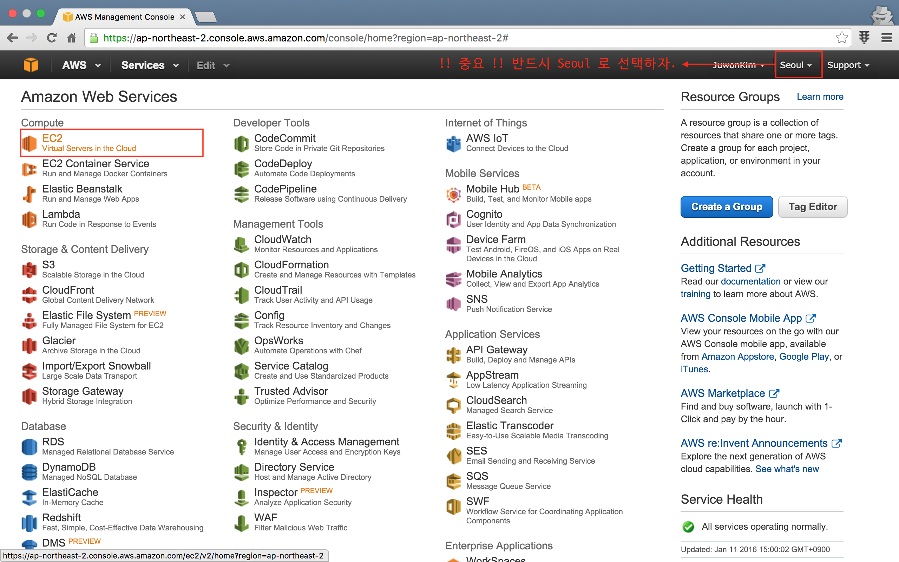
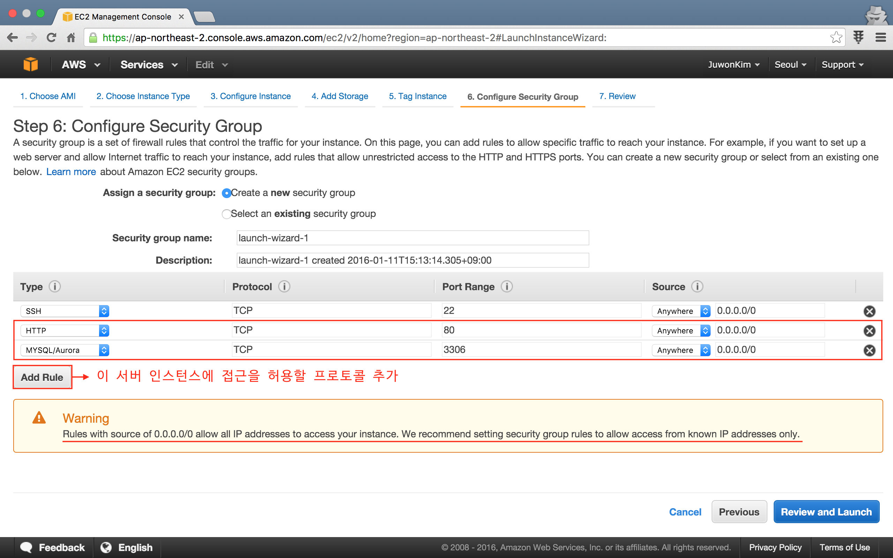
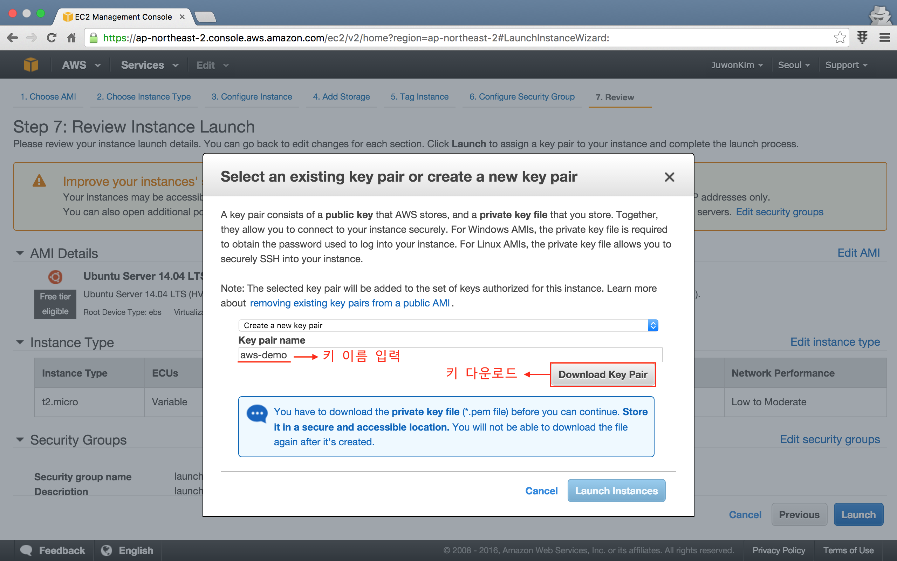
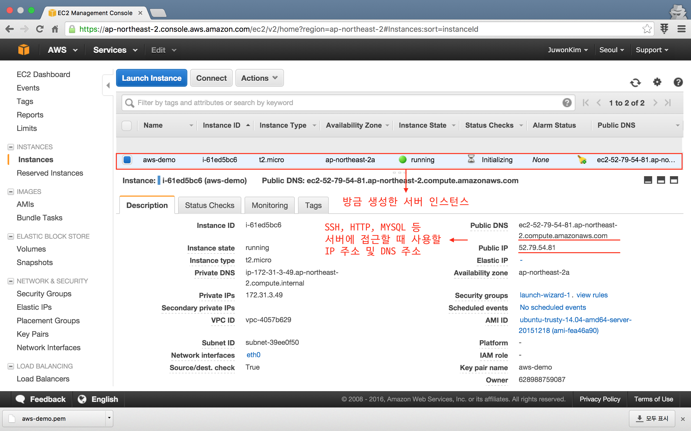
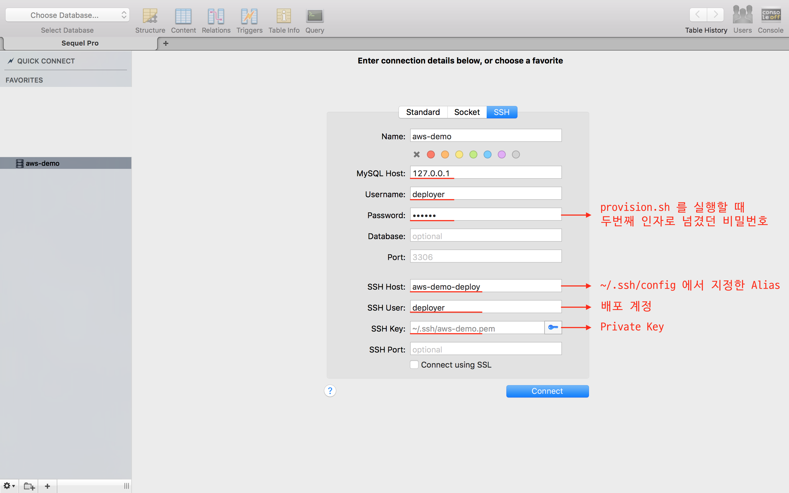
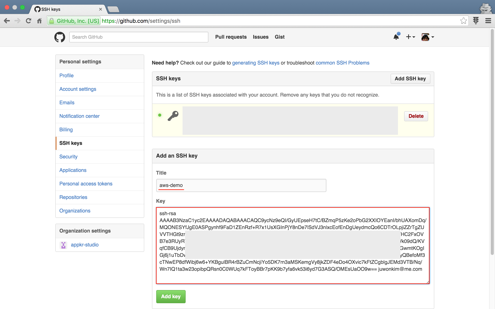

# 코드 배포 

웹 프로그래머의 삶이 여유롭지는 않다. 왜냐하면, 사용자와 접하게 되는 UI/UX 요소인 CSS/JS 부터 시작해서, 서버 설치 및 운영까지 다 할 줄 알아야 될 뿐 아니라, 하루가 다르게 쏟아져 나오는 새로운 기술과 툴들을 익혀야 하기 때문이다. 그 뿐인가, 개발에 필요한 디자인 패턴이며, 컴퓨터 네트워크의 동작 원리 등등 배워야 할 것이 산적해 있기도 하다. 운이 좋아 FE (==Front End), BE (==Back End), SE (==Systems Engineer) 로 업무가 모두 나뉘어 있는 큰 회사에 소속되어 있다면 좋을텐데... 모두가 그런 행운아의 주인공일 수는 없일 일. 참고로, FE, BE, SE 의 영역을 모두 아우르는 프로그래머를 [풀 스택 프로그래머](https://speakerdeck.com/driesvints/the-laravel-ecosystem?slide=17) 라고 한다.

꼭 웹 프로그래머가 아니더라도, 프로그래머의 삶이 좋은 이유가 있긴 하다. "배움에 소홀하지 않다면", 동네 내과 병원의 백발이 성성한 70대 원장님 처럼, 계속 프로그래밍으로 생계를 유지할 수도 있기 때문이다. **"배움에 소홀하지 않다면..."**

서론이 길었다. 이번 강좌에서는 코드 배포하는 것을 배울 것이다. 아무리 훌륭한 웹 어플리케이션 또는 서비스를 만들었다고 해도 서버에 올라가서 사용자들에게 서비스가 되지 않는다면, 만들지 않은 서비스 또는 존재하지 않는 서비스나 마찬가지이다. 즉, 코드 배포는 (웹) 프로그래머로서 꼭 알아야 할 주제라고 강조하고 싶다.

## 학습 목표
  
1.  **Amazon Web Service 에 웹 서버를 생성해 본다.**

    이 강좌를 쓰고 있는 시점이 2016년 1월 11일(월)인데, 2016년 1월 7일(목)에 Amazon Web Service 의 12번째 Region 인 Seoul Region 이 새롭게 추가되었다. Seoul Region 의 속도나 가격 비교는 [정창훈님의 블로그 포스트](http://blog.iamseapy.com/archives/250) 를 참고하면 되는데, 결론은 빠르고 싸다는 것이다. 필자도 Seoul Region 오픈 다음날, 이 강좌의 라이브 데모 사이트를 Seoul 로 옮겼다.
    
2.  **Envoy (SSH Task Runner) 사용법을 익힌다.**

    이 강좌를 통해서 FE 리소스를 관리하고 빌드하는 [Elixir](29-elixir.md), 팀 내 개발 환경을 표준화할 수 있는 [Homestead](02-install-homestead-osx) 등의 사용법을 살펴 보았다. 라라벨에서는 원격 서버에서의 복잡하고 반복되는 작업을 편리하게 할 수 있도록 도와 주는 [Envoy](https://laravel.com/docs/envoy) 라는 툴도 제공하고 있다. **Envoy 는 Non-Laravel, Non-PHP 프로젝트에서도 사용할 수 있다** 는 점을 강조하고 싶다.
    
3.  **Envoy 와 Git 을 이용하여 코드를 배포해 본다.**

    Envoy 는 코드 배포를 위한 도구가 아니다. Git 도 코드 배포를 위한 도구는 아니다. 하지만, 우리는 이 둘을 결합하여 깔끔하게 동작하는 코드 배포 도구를 만들것이다.
    
## Hello AWS Seoul

### 회원 가입 및 Free Tier 사용하기

Amazon 에 신규로 회원 가입을 하면 1년 동안 무료로 [Free Tier 서비스](http://aws.amazon.com/ko/free/) 를 이용할 수 있다. 가입 과정에서 해외 결재가 가능한 신용카드가 필요하니 미리 준비해야 한다. 신용카드는 신분 확인만을 위한 장치일 뿐, 당장 결재가 되는 것은 아니니 거부감을 가질 필요는 없다. 매해 신용카드를 바꾸어 가며, Free Tier 를 옮겨 다니는 분들도 봤다. Shared 호스팅이 아니라, 자신만의 독립서버를 1년 동안 무료로 쓸 수 있는데, 쓰지 않을 이유는 없지 않는가? 

"개발 기간동안은 맘껏 써 봐라. 대신 서비스가 커지고 수익을 창출하면 돈을 좀 내 줘~ 장사 하루 이틀 할 것도 아닌데...". Amazon 을 갓마존 또는 대인배라고 하는 이유가 있다.

### EC2 인스턴스 생성

회원 가입을 하고 나서 로그인을 하면, AWS 의 모든 제품군이 나열된 AWS Management Console 화면을 볼 수 있을 것이다. 우리는 Compute 섹션의 EC2 만 사용할 것이다. **네비게이션 메뉴 오른쪽 위에 Region 선택 드롭다운에서 반드시 Seoul 로 선택하자.**  



EC2 제품을 눌러 표시된 화면에서, 중앙에 위치한 **"Launch Instance"** 버튼을 눌러 새로운 서버 인스턴스를 만들자. 총 7 단계를 거치는데 거의 대부부분이 그냥 **"Next"** 로 넘어가면 된다. 이 강좌 작성 이후, Amazon 의 화면 구성이나 UI 는 시간이 지남에 따라 언제든 달라질 수 있으니, 아래 설명을 참고해서 적응적으로 적용하도록 하자.

**Step 1: Choose an Amazon Machine Image (AMI)** 화면에서 `Free Tier Eligible` 이라고 표시된 `Ubuntu Server 14.04 LTS (HVM), SSD Volume Type` 을 선택하자. 


2 ~5 단계는 특별한 것이 없다. **Step 6: Configure Security Group** 화면에서 **"Add Rule"** 버튼을 눌러, `HTTP` 와 `MYSQL` 을 추가해 주자. 아래 그림의 보안 경고에 보이듯이, HTTP 를 제외하고는 IP 를 지정하는 것이 보안 측면에서 좋다. 참고로, 앞으로 진행하는 과정 중에 자연스럽게 OpenSSL 기반의 Self-signed 인증서가 설치되므로, HTTPS 를 상용으로 쓸 예정이라면 개발 과정에 HTTPS 룰도 추가해 주자. 



**Step 6: Configure Security Group** 화면에서 **"Review and Launch"** 버튼, **Step 7: Review Instance Launch** 화면에서 **"Launch"** 버튼 순으로 진행한다. Step 7 에서 버튼을 누르는 순간, 서버에 SSH 로 접속하기 위한 Private Key 를 만드는 화면이 뜨는데, 키 이름을 입력하고, **"다운로드"** 버튼을 눌러 '~/.ssh' 디렉토리 아래에 저장하자. **"Launch"** 버튼을 한번 더 누르면 서버 생성이 시작된다. 대략 30초 이내로 끝난다.

**`참고`** AWS 에서 SSH Key 는 인스턴스가 생성될 때 딱 한번 발급/지정할 수 있다. Key 를 잊어 버리면, 서버를 지우고 다시 생성해야 하니, Key 관리를 잘 해야 한다.
 


콘솔 화면에 다시 돌아오면, 생성된 서버 인스턴스를 확인할 수 있다. IP 와 DNS 는 곧 써야 하니, 어떤 화면 어디 쯤에 위치해 있는지 잘 봐 두자.



### 서버에 접속

SSH 로 접속하기 위한 기본 설정을 수정한다.

좀 전에 다운로드 받은 키 파일은 나 (==소유자) 만 읽기 가능하도록 해야 한다.

```bash
$ chmod 400 ~/.ssh/aws-demo.pem
```

매번 `$ ssh ubuntu@52.79.54.81 -i ~/.ssh/aws-demo.pem` 을 쳐야 하는 번거로움을 피하기 위해 SSH config 를 작성한다.

```bash
$ nano ~/.ssh/config
```

config 파일에 아래 내용을 넣고 <kbd>Ctrl</kbd> + <kbd>x</kbd>, <kbd>Y</kbd> 를 눌러 저장한다. 

```bash
Host aws-demo
    Hostname 52.79.54.81              # AWS Console 에 표시된 IP 또는 DNS 주소
    User ubuntu                       # 기본  계정은 'ubuntu' 이다.
    IdentityFile ~/.ssh/aws-demo.pem  # 좀 전에 다운로드 받은 Private Key 지정
```

서버로 접속해 보자.

```bash
# 로컬 컴퓨터에서

$ ssh aws-demo
# The authenticity of host '52.79.54.81 (52.79.54.81)' can't be established.
# ECDSA key fingerprint is SHA256:+xxxxxxxxxxxxxxxxxxxxxxxxxxxxxxxxxxxxxxxxx.
# Are you sure you want to continue connecting (yes/no)?
# "yes" 를 타이핑하고 엔터.

ubuntu@ip-xxx-xx-x-xx:~$
```

**`참고`** 앞으로 진행될 내용에서 `ubuntu@ip-xxx-xx-x-xx:~$` 라고 표시되면 원격 서버의 SSH 접속된 콘솔을 의미하며, `...$` 는 사용자 계정, `...#` 는 root 계정을 의미한다. 로컬 컴퓨터의 콘솔은 `$` 로 구분된다.  

## Hello Web Server

### 배포 사용자 계정 준비

SSH 로 서버에 접속되었다. 먼저 이 서버에 코드를 배포하고, 웹 서버의 사용자로 사용될 계정을 만들것이다.

```bash
$ ssh aws-demo

# sudo 를 계속 쳐야 하는 번거로움을 피하기 위해 아래 명령으로 root 로 로그인한다.
ubuntu@ip-xxx-xx-x-xx:~$ sudo -s
```

코드 배포에 사용할 `deployer` 란 계정을 만들고, 이 계정을 `www-data` 그룹에 추가하자.

```bash
root@ip-xxx-xx-x-xx:~# adduser deployer
# Enter new UNIX password:      # deployer 계정이 사용할 비밀번호
# Retype new UNIX password:     # 비밀번호 확인
# ...
# Enter the new value, or press ENTER for the default
#     Full Name []: Deployer
# Is the information correct? [Y/n] Y

root@ip-xxx-xx-x-xx:~# usermod -G www-data deployer
```

`deployer` 계정이 `sudo` 입력 없이 쉘 (==콘솔) 명령을 수행할 수 있는 권한을 주자.

```bash
root@ip-xxx-xx-x-xx:~# visudo
```

열린 파일 마지막에 아래 내용을 추가하자.

```bash
# deployer 계정에 대한 권한 부여
deployer ALL=(ALL:ALL) NOPASSWD: ALL

# www-data 그룹에 대한 권한 부여
%www-data ALL=(ALL:ALL) NOPASSWD:/usr/sbin/service php5-fpm restart,/usr/sbin/service nginx restart
```

*참고로 필자는 SE 나 서버 보안 전문가가 아니므로, 이 강좌의 내용이 완벽한 서버 보안을 보장할 수 없다는 점을 양해해 주기 바란다.*

### 서버 프로비저닝

이제 LNMP (==`Linux` + `Nginx` + `MySql` + `PHP`) 스택을 설치하고 웹 서버로 기동할 준비를 해 보자.

필요한 모듈을 한줄씩 쳐서 설치하는 번거로움을 피하기 위해 [appkr/envoy](https://github.com/appkr/envoy) 리포지토리에서 제공하는 스크립트들을 이용할 것이다. 얘네들은 `Git`, `Build Tool`, `Nginx`, `PHP & required Modules`, `Composer`, `MySql`, `...` 등을 한번에 설치하는 역할을 하는 Bash Script 이다. 설치에 5 ~ 10 분 정도 소요된다.

```bash
root@ip-xxx-xx-x-xx:~# wget https://raw.githubusercontent.com/appkr/envoy/master/scripts/provision.sh 

# 첫번째 인자는 배포 계정 이름, 두번째 인자는 MySql 로그인에 사용할 비밀번호 
root@ip-xxx-xx-x-xx:~# bash provision.sh deployer secret

# 작업이 완료된 후, 필요한 모듈들이 잘 설치되었나 확인해 보자.
root@ip-xxx-xx-x-xx:~# which nginx
root@ip-xxx-xx-x-xx:~# which php5-fpm
root@ip-xxx-xx-x-xx:~# which mysql
root@ip-xxx-xx-x-xx:~# git --version
root@ip-xxx-xx-x-xx:~# php --version
root@ip-xxx-xx-x-xx:~# composer --version
root@ip-xxx-xx-x-xx:~# ...
```

Nginx Sites 를 빠르게 만들기 위한 `serve.sh` Bash Script 도 다운로드 받아 이용하자. 다행히 요건 순식간에 끝난다.

```bash
root@ip-xxx-xx-x-xx:~# wget https://raw.githubusercontent.com/appkr/envoy/master/scripts/serve.sh

# 첫번째 인자는 도메인 이름, 두번째 인자는 Document Root 경로
root@ip-xxx-xx-x-xx:~# bash serve.sh ec2-52-79-54-81.ap-northeast-2.compute.amazonaws.com /home/deployer/www/aws-demo/public

# 작업이 완료된 후 잘 설정되었나 확인해 보자. 특히 server_name 과 root 지시자가 정확한지 눈여겨 보자.
root@ip-xxx-xx-x-xx:~# cat /etc/nginx/sites-enabled/ec2-52-79-54-81.ap-northeast-2.compute.amazonaws.com
```

### `deployer` 계정으로 로그인하기

`deployer` 계정으로 로그인하기 위해서 로컬에서 `ssh-keygen` 으로 Key Pair 를 생성하고, 서버에 Public Key 를 등록하는 방법도 있지만, 편의상 여기서는 `ubuntu` 계정의 Public Key 를 그대로 사용하기로 하자.

```bash
# deployer 계정에 .ssh 디렉토리 생성
root@ip-xxx-xx-x-xx:~# mkdir /home/deployer/.ssh
root@ip-xxx-xx-x-xx:~# chown deployer:deployer /home/deployer/.ssh

# ubuntu 계정에 등록된 public key 레지스트리를 deployer 계정에 복사
root@ip-xxx-xx-x-xx:~# cp /home/ubuntu/.ssh/authorized_keys /home/deployer/.ssh/

# /home/deployer/.ssh 디렉토리 전체에 대한 소유권 부여 
root@ip-xxx-xx-x-xx:~# chown deployer:deployer -R /home/deployer/.ssh
```

이제 로컬로 돌아와서, 생성한 `deployer` 계정으로 서버에 접속할 수 있도록 설정하자. 서버에서 로그아웃 할 때는, 로컬로 돌아올 때 까지 `exit` 를 여러 번 입력하면 된다.

`$ nano ~/.ssh/config` 명령으로 기존 'aws-demo' 외에 'aws-demo-deploy' 란 레코드를 하나 더 만들자. 

```bash
Host aws-demo-deploy
    Hostname 52.79.54.81
    User deployer
    IdentityFile ~/.ssh/aws-demo.pem
```

SSH 로그인을 해보자.

```bash
$ ssh aws-demo-deploy
deployer@ip-xxx-xx-x-xx:~$
```

### MySql 서버 접속

MySql 로그인을 해보자.



이제 서버 쪽에 모든 준비는 완료된 상태이다. Envoy 에 대해 배워 보고, 배포 스크립트를 만들어 보자.

## Hello Envoy

### Envoy Executable 설치

Envoy 문법에 대한 자세한 설명은 [공식 문서](https://laravel.com/docs/envoy) 와 필자의 [슬라이드](http://www.slideshare.net/ssuser7887b3/envoy-56730937) 를 참고하도록 하자.

요약하자면 Envoy 는 로컬 컴퓨터에서 원격 서버에 미리 정의된 작업을 시키는 도구라고 할 수 있다. Envoy Executable 을 로컬 컴퓨터에 설치하자.

```bash
# 로컬 컴퓨터에서

$ composer global require "laravel/envoy=~1.0"
$ envoy --version
```

자신의 콘솔 프로파일 (`.zshrc`, `bash_profile`, `.bashrc`, `...`) 에 Composer Global 컴포넌트에 대한 경로 설정 (`export PATH="$PATH:$HOME/.composer/vendor/bin"`) 이 되어 있지 않다면, 추가해 줘야, `$ envoy` 명령을 경로 지정없이 어떤 디렉토리에서든 실행할 수 있다.

**`참고`** Envoy 는 Global 로 설치하지 않고 프로젝트 단위로 설치해도 된다. 단, 이 경우에는 프로젝트 디렉토리에서 `$ vendor/bin/envoy` 로 명령을 실행해야 한다.

### Envoy Script

Envoy 는 항상 `envoy.blade.php` 가 위치한 프로젝트 디렉토리에서 실행해야 한다. `appkr/envoy` 리포지토리에서 예제 Envoy Script 를 다운로드 받아 수정하여 사용하도록 하자.

```bash
# 로컬 컴퓨터에서

$ cd myProject
$ wget https://raw.githubusercontent.com/appkr/envoy/master/envoy.blade.php
# wget 또는 curl 이 없다면 브라우저로 해당 주소를 방문해서, 본문 내용을 복붙한 envoy.blade.php 파일을 만들고 저장해도 된다.
```

일단 서버 주소만 수정하고, 첫 Envoy 명령을 수행해 보자. `aws-demo-deploy` 란 이름은 앞 절에서 '~/.ssh/config' 에서 정의한 Hostname 에 대한 별칭임을 기억하자. '~/.ssh/config' 정의가 없었다면 `deployer@52.79.54.81` 로 쓸 수도 있다.

```php
// envoy.blade.php

@servers(['web' => 'aws-demo-deploy'])
```

```bash
# 로컬 컴퓨터에서

$ envoy run hello
[aws-demo-deploy]: Hello Envoy! Responding from ip-xxx-xx-x-xx
```

와우~!!! 로컬 컴퓨터에서 SSH 로 접속하지 않고도, 명령 한줄으로 원격 서버에 지정된 계정으로 들어가서 `hello` Task 를 수행하고, 그 수행 결과를 로컬로 다시 되돌려 준 것이다.

### Envoy Script II

배포를 위한 설정들을 변경하자.

```php
// envoy.blade.php

@setup
  $path = [
    // release Task 수행 중에 변수로 사용할 디렉토리 경로들.
    'base' => '/home/deployer/www',
    'docroot' => '/home/deployer/www/aws-demo',
    'shared' => '/home/deployer/www/shared',
    'release' => '/home/deployer/www/releases',
  ];

  $required_dirs = [
    // release Task 수행 중에 없으면 만들어야 할 디렉토리 목록들.
    $path['base'],
    $path['shared'],
    $path['release'],
  ];

  $shared_item = [
    // release Task 수행 중에 Symlink 로 연결되어야 할 공유 디렉토리/파일들.
    '/home/deployer/www/shared/.env' => '.env',
    '/home/deployer/www/shared/storage' => 'storage',
    '/home/deployer/www/shared/cache' => 'cache',
  ];

  $distribution = [
    // 그냥 두자.
    // 매 release Task 수행시 마다 아래 정의한 디렉토리에 Git Clone 을 하게 된다.
    'name' => 'release_' . date('YmdHis'),
  ];

  $git = [
    // release Task 에서 Git Clone 을 할 대상이 되는 Git Repo 의 주소.
    'repo' => 'git@github.com:vendor/project',
  ];
@endsetup
```

서버에 접속한 후, `$shared_item` 에 정의한 디렉토리/파일은 생성해 놓자. 없으면 Symlink 에러날 수 있으니..

```bash
# $shared_item 디렉토리/파일 목록은 라라벨 프로젝트를 가정하고 설정한 것이다.
# 다른 프레임웍이라면 공유될 리소스를 알맞게 지정하도록 하자.

$ ssh aws-demo-deloy

deployer@ip-xxx-xx-x-xx:~$ mkdir www
deployer@ip-xxx-xx-x-xx:~$ mkdir www/shared
deployer@ip-xxx-xx-x-xx:~$ mkdir www/shares/storage www/shared/cache
deployer@ip-xxx-xx-x-xx:~$ touch www/shared/.env
# .env 에 환경 설정 내용을 채워 놓도록 하자. 내용이 없다면 release Task 의 Composer Install 과정에서 에러가 날 가능성이 있다.
```

## 코드 배포

### Git Clone 을 위한 Key 설치

우리의 원격 서버가 Github 서버와 통신할 수 있기 위해서는, aws-demo 서버에 Github 접속을 위한 SSH Private Key 가 있어야 한다. 아래 내용은 [Github 공식 문서](https://help.github.com/articles/generating-ssh-keys/) 를 그대로 따라한 것이다.

```bash
$ ssh aws-demo-deloy

deployer@ip-xxx-xx-x-xx:~$ ssh-keygen -t rsa -b 4096 -C "your_email@example.com"
# Key 이름과 passphrase 를 넣는 질문이 나오는데 필요하다면 입력하자. 필자의 경우에는 그냥 엔터했다.

deployer@ip-xxx-xx-x-xx:~$ cat .ssh/id_rsa.pub
# 콘솔에 출력된 내용을 블럭으로 잡아 복사해 두자.
```

복사한 내용을 [Github Setting 의 SSH keys 페이지](https://github.com/settings/ssh) 를 방문하여 **"Add SSH Key"** 버튼을 눌러 붙여 넣는다.
 


그러고나서, 아래 과정을 꼭 한번은 거쳐 주어야 한다. Github 서버가 aws-demo 서버를 인식하게 하는 과정이다.

```bash
deployer@ip-xxx-xx-x-xx:~$ ssh -T git@github.com
# Are you sure you want to continue connecting (yes/no)?
# yes 치고 엔터
```

### Release

이걸 할려고 이제까지 복잡한 과정을 수행했다. 모든 준비가 완료되었다. 보통 요 앞의 과정까지 숙달된 사람의 경우 스크립트 없이 4시간, 숙달되지 않은 사람의 경우 짧게는 이틀, 좀 헤메면 일주일 걸린다.  

코드를 배포하자.

```bash
# 로컬 컴퓨터에서

$ envoy run release
```


앞으로 코드가 변경되어 `$ git push` 를 하고, 서버에 릴리즈해야 할 일이 있다면... 위 명령 한번으로 끝난다. 스크린샷이 aws-demo 가 아니라 필자가 라이브 데모로 사용하는 aws-seoul-deploy 로 되어 있는 점 양해 바란다. 필자의 라이브 데모 사이트의 경우, `release` Task 수행에 총 30 초 정도 소요되었다.

### `release` Task 의 동작 원리

`@servers(['web' => 'aws-demo-deploy'])` 와 `@task('release', ['on' => 'web'])` 에 지정된 서버에 백그라운드에서 SSH 로그인한 후 아래 작업을 순차적으로 진행하고, 그 수행 결과를 로컬 컴퓨터 터미널에 표시해 준다.

1.  `$required_dirs` 에서 정의한 디렉토리가 없다면 생성한다.
2.  `$path['release'] . '/' . $distribution['name']` 디렉토리에 `$git['repo']` 로 정의한 코드 베이스를 Clone 한다.
3.  방금 Clone 한 디렉토리에서 Composer Component 를 설치한다.
4.  방금 Clone 한 디렉토리에 `$shared_item` 에 정의한 공유 디렉토리와 파일을 Symbolic Link 로 연결한다.
5.  방금 Clone 한 디렉토리를 Nginx 의 Document Root 로 Symbolic Link 한다.
6.  방금 Clone 한 디렉토리 및 그 하위에 연결된 Symbolic Link 들에 대한 그룹 권한을 `www-data` 로 변경한다.

Git 과 Envoy 를 응용한 이 배포 스크립트의 장점은, 

1.  **Zero Conflict**
    
    매번 Git Clone 하는 전략을 취함으로써 `$ git push --force` 를 했을 경우, 서버에서 발생할 수 있는 Code Conflict 를 없애준다.
     
2.  **Zero Downtime**
    
    DB, 캐시/세션 스토리지, 환경설정등은 릴리즈 디렉토리 밖에 존재하면서 릴리즈에 Symlink 로 연결되며, 코드, 의존 모듈 등 모든 준비가 완료된 후, 이번 릴리즈 디렉토리를 Document Root 로 Symlink 하기 때문에, 서비스의 다운 타임이 발생하지 않는다.
     
3.  **Release 이력 관리 및 빠른 롤백**
    
    매번 기존 코드를 엎어 쓰는 Git Checkout, Git Pull 전략이 아니라, Git Clone 전략을 이용하므로, 이전 릴리즈들도 바로 사용이 가능한 상태로 서버에 그대로 남아 있게 된다. 즉, 릴리즈에 문제가 있을 경우, 이전 릴리즈로 롤백이 가능하단 얘기다. 이 참고용 `envoy.blade.php` 스크립트에는 `release` Task 외에도 `list`, `checkout`, `prune` 등의 추가 Task 를 포함하고 있다. 사용법은 [`appkr/envoy` 문서](https://github.com/appkr/envoy) 또는 코드를 참고하자.  
    
<!--@start-->
---

- [목록으로 돌아가기](../readme.md)
<!--@end-->